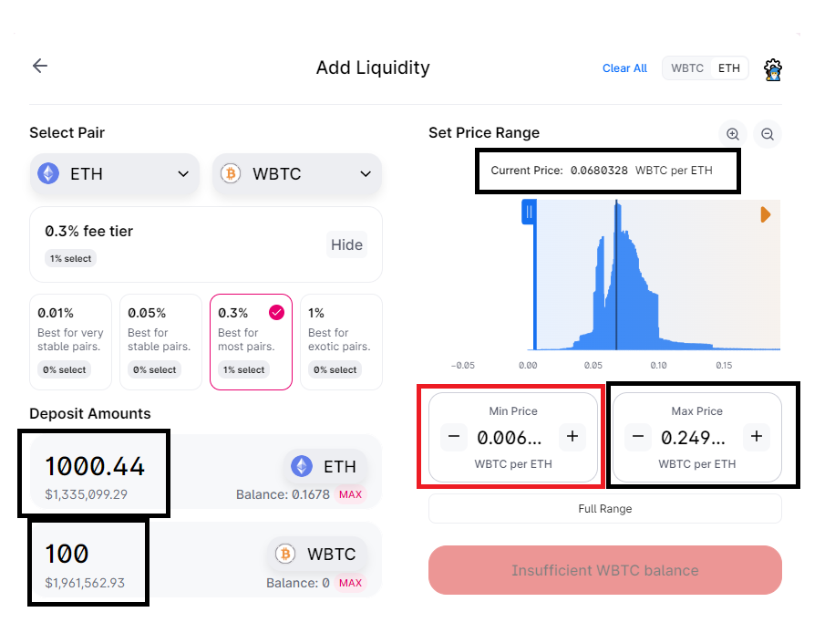
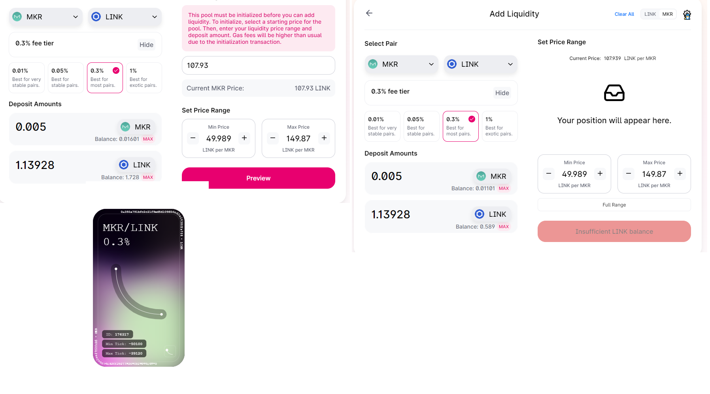
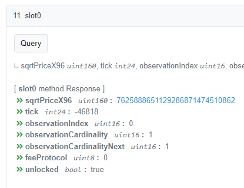
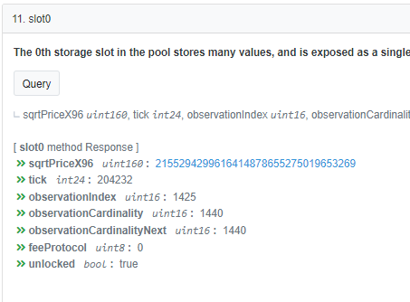
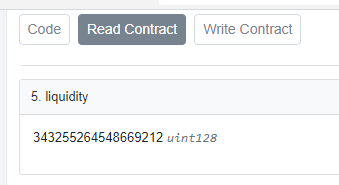

# Intro

Uniswap v2 is an automatic market maker that pools deposits of 2 tokens, here we will assume Ether (ETH) and wrapped Bitcoin (wBTC), and allows anyone to autonomously trade between the assets using that pool by paying a fee, e.g., 0.3%.

To do this, it takes both extreme relative prices:

-   1 ETH = 0 BTC
-   1 ETH = Infinite BTC

And uses a constant product function `x * y = k` to calculate how much of token x to provide to traders looking to offload token y. Note this is separate from the 0.3% fee. All trades, but especially large trades, *impact the relative price* of the tokens when trading, this is called price impact.

# Simulated WBTC-ETH Uniswap v2 Pool

For example, assume the current price of 1 ETH is 0.1 WBTC and that a liquidity pool exists with 1,000 ETH and 100 WBTC. This means the constant product `k = 1000*100 = 100,000`

Any trade is allowable as long as the resulting balance of X ETH and Y WBTC remains 100,000. Notice how US Dollar prices are not relevant. It is only the constant product enforcing relative prices that matters.

```{r, warning=FALSE, message=FALSE, fig.show='hide'}
options(scipen = 20)
library(dplyr)
library(plotly)
library(reactable)

kfunc <- function(x, k = 100000){
  # returns y for an x that meets condition x*y = k
 y = k/x
 return(y)
}


# draws plot and returns values 
# This plots by default: suppressing this to only get data.
x <- curve(kfunc, 0, 1000, n = 1001, xlab = 'BTC', ylab = 'ETH')
```

```{r,  warning=FALSE, message=FALSE}
pool <- data.frame(
  btc = x$x,
  eth = x$y
)

# for simplicity focus in on 100 BTC range
relevant_pool <- pool[50:180, ]

plot_ly(relevant_pool, x = ~btc) %>% 
  add_trace(y = ~eth, mode = 'lines', type = 'scatter', name = 'Constant Product') %>% 
  add_trace(x = ~100, y = ~1000, type = 'scatter', mode = 'markers', name = 'Current Price') %>% 
  layout(title = "Close up of Constant Product Curve around 100 BTC",
         annotations = list(x = 105, y = 1100,
                            text = 'Current Price',
                            showarrow = FALSE))
  
```

The orange point denotes the current (relative) price 1 ETH = 0.1 BTC, or more specifically 100 BTC = 1,000 ETH. But to *trade* with the pool *causes* a change in the price.

Reviewing the table form of the 95 - 105 BTC range where k = 100,000 shows the price point of several potential trades.

```{r,  warning=FALSE, message=FALSE}
price_snippet <- pool[96:106, ]
price_snippet$btc_delta <- price_snippet$btc - 100
price_snippet$eth_delta <- price_snippet$eth - 1000
price_snippet <- price_snippet %>% round(4) # 4 decimals

reactable(price_snippet %>% round(3), defaultPageSize = 25)
```

If you have 1 BTC and want ETH you would change the pool balance from:

-   100 BTC and 1000 ETH

to

-   101 BTC and 990.099 ETH

Meaning that although the price *was* 0.1 BTC per ETH originally. You actually only get `r 1000 - 990.099` ETH for your 1 BTC (would be less after any fee, e.g., 0.3%). This is the *price impact* mentioned previously. Instead of 0.1 BTC per ETH, you pay 0.10099 BTC per ETH. a **0.99%** price impact.

In the other direction if you want 5 BTC you would need to provide 52.6316 ETH to change the pool's composition to 95 BTC (and 1,052.6316 ETH). Instead of 0.1 BTC per ETH, you only get 0.09499 BTC per ETH. A **5.01%** price impact.

The larger the trade (5 BTC instead of 1 BTC) the worse the price impact.

The solution to this is to widen the curve by deepening the liquidity available. If instead the pool was 10,000 BTC and 100,000 ETH, trades of 1 BTC or even 5 BTC would be much closer to 0.1 BTC per ETH (it would not be exact because price impact still occurs).

# Real World WBTC-ETH Uniswap v2 Pool

Looking at the [Uniswap v2 ETH/WBTC pool](https://v2.info.uniswap.org/pair/0xbb2b8038a1640196fbe3e38816f3e67cba72d940%3E) analytics page.

{width="300"}

245.7565 WBTC and 3,532 ETH are in this pool. This is a relative price of 0.06957 BTC per ETH. Bitcoin is doing better against ETH than in the fake example above.

The constant product `k = 245.7565 * 3532 = 868,012`. This makes the real pool significantly more *deep* than in the fake intro example. So price impacts should be much smaller!

The constant product curve for the real pool is here:

```{r, fig.show='hide'}

x_real <- curve(kfunc(x, k = 868012), 200, 300, n = 100000, xlab = 'BTC', ylab = 'ETH', add = FALSE)

```

```{r,  warning=FALSE, message=FALSE}
pool_real <- data.frame(
  btc = x_real$x,
  eth = x_real$y
)

plot_ly(pool_real, x = ~btc) %>% 
  add_trace(y = ~eth, mode = 'lines', type = 'scatter', name = 'Constant Product') %>% 
  add_trace(x = ~245.7565, y = ~3532, type = 'scatter', mode = 'markers', name = 'Current Price') %>% 
  layout(title = "Close up of Constant Product Curve around 245 BTC",
         annotations = list(x = 255, y = 3590,
                            text = 'Current Price',
                            showarrow = FALSE))
```

Unlike before, because this pool is deeper a move of 1 BTC is much more easily absorbed.

```{r,  warning=FALSE, message=FALSE}
one_increments <- pool_real[seq(from = 40757, 50757, by = 1000), ]

one_increments$btc_delta <- one_increments$btc - 245.7565
one_increments$eth_delta <- one_increments$eth - 3532
one_increments <- one_increments %>% round(2) # 3 decimals
reactable(one_increments)
```

Selling 1 BTC to force the pool from 245.7565 to 246.7565 would remove 14.3131 ETH form the pool. This `r 1/14.3131` BTC per ETH is very close to the original relative price of 0.06957 BTC per ETH, only a **0.42%** price impact.

In the other direction if you want 5 BTC you would need to provide 73.3537 ETH. This `r 5/73.3537` BTC per ETH a **2.02%** price impact.

## Real World Uniswap v2 Confirmation

The 245.7565 WBTC; 3,532 ETH V2 Pool was as of Block 15,562,988. [This transaction](https://etherscan.io/tx/0x1f23e1feb1def28e5b5c7c4800dc66ff8338e114657593d08d9c6891471806d5) shows a trade of 1.3159 ETH for 0.0913 BTC in that block.

The constant product math with `k = 868,012` including the 0.3% fee would expect the following result:

`( 3532 - (1.3159*0.997) ) * (245.7565 + x) = 868,012`

Where the expected 0.0913 matches the transaction.

x = `round(868012/(3532 - 1.3159*0.997) - 245.7565, 4)`

x = `r round(868012/(3532 - 1.3159*0.997) - 245.7565, 4)`

Rounding, in addition to the possibility of *other trades* happening in the same block before this transaction (blocks are comprised on transactions and transactions within a block go in order) affecting the pool could lead to small differences in the expected and actual results. But our calculation and the real world matched to 4 significant digits.

# Simulated WBTC-ETH Uniswap v3 Pool

Uniswap v3 introduces *concentrated liquidity*. Instead of 1 pool covering all the extreme price ranges:

-   1 ETH = 0 BTC
-   1 ETH = Infinite BTC

Users individually provide target ranges, e.g.,

-   Minimum Price: 0.05 BTC/ETH => 1 ETH = 0.05 BTC (1 ETH *only* gets 0.05 BTC)
-   Maximum Price: 0.25 BTC/ETH => 1 ETH = 0.25 BTC (1 ETH gets 5 times as much: 0.25 BTC)

It can be tricky to think about these as minimums and maximums. It may help to recall that Automated Market Makers sell winners to buy losers and charge a fee for doing so. So as ETH rises in value (1 ETH buys more BTC) the liquidity pool, given a constant product, becomes disproportionately full of BTC instead of ETH.

In the extreme case, if the 100 BTC 1,000 ETH Liquidity Pool with 1 ETH = 0.1 BTC price mentioned above shifted to 1 ETH = 10 BTC, the pool would have to flip to 1,000 BTC and 100 ETH. The BTC comes from sellers of BTC who buy ETH: forcing the pool's balance to change (because of constant product).

Recall the Simulated 100 BTC; 1000 ETH liquidity pool from before but this time with two prices on the range noted: 1 ETH = 0.05 BTC and 1 ETH = 0.25 BTC.

```{r, warning=FALSE, message=FALSE}

p_func <- function(k = 100000, p = 0.05){
  # x * y = k
  # p = x/y
  # x = py
  # py * y = k
  # y = sqrt(k/p)
  # x = py
  
  y = sqrt(k/p)
  x = p*y
  
  return(
    list(x = x, y = y)
  )
}

low = p_func(k = 100000, p = 0.05)
high = p_func(k = 100000, p = 0.25)

plot_ly(relevant_pool, x = ~btc) %>% 
  add_trace(y = ~eth, mode = 'lines', type = 'scatter', name = 'Constant Product') %>% 
  add_trace(x = ~low$x, y = ~low$y, mode = 'markers', name = '1 ETH = 0.05 WBTC') %>%
  add_trace(x = ~high$x, y = ~high$y, mode = 'markers', name = '1 ETH = 0.25 WBTC') %>%
  add_trace(x = ~100, y = ~1000, type = 'scatter', mode = 'markers', name = 'Current Price') %>% 
  layout(title = "\n Constant Product with Ranges",
         annotations = list(x = 115, y = 1050,
                            text = 'Current Price',
                            showarrow = FALSE)) %>% 
  layout(
    xaxis = list(
      range=c(0,180)
    )
  )

```

In Uniswap v3, liquidity providers choose their range (e.g., Min 1 ETH = 0.05 BTC to Max 1 ETH = 0.25 BTC) and spread their liquidity (i.e., tradeability between two tokens) across the range. When someone is out of range (e.g., if 1 ETH = 0.049 BTC) their position is 100% in the lower value asset (they sold all their winners to buy the trader's losers with the hope their share of fees makes up for the loss).

## Understanding Uni v3 Ticks

Ticks act like 'buckets' of liquidity pooled from multiple providers. As trades occur, price impact happens using the same x*y = k formula within a tick. Ticks become exhausted of liquidity as price impact moves pushes the relative prices into other buckets of liquidity (i.e., across ticks).

This range is spread across ticks where each (integer) tick `i` is tracked with the formula:

`sqrt(price[i]) = sqrt(1.0001)^[i]`

Ticks are *not* the same size. They are 0.01% apart from their neighboring ticks!

Although we target a price range of 0.05 and 0.25, in actuality, the exact ticks need to fit within the tick spacing of the pool (which varies by fee tier).

For the ETH-WBTC 0.3% Fee Tier we would choose whichever range is as close as possible to our desired range while still being an integer of ticks and meeting the required tick spacing (60 for this pool on Ethereum). In addition to this tick spacing, for any pool, differences in the allowable decimals of the tokens will require a decimal adjustment.

Most ERC20 that are not stablecoins use 18 decimals and won't require an adjustment with ETH. But wrapped Bitcoin, WBTC, has 8 decimals to mimic Bitcoin; while ETH has 18. Thus, a 1e10 (18-8 = 10) decimal adjustment is needed.

For a USDC-WETH pool; USDC has 6 decimals. Thus, a 1e12 (18 - 6 = 12) decimal adjustment is needed.

Tick spacing matters significantly and changes by price tier. The USDC-WETH 0.3% pool has a 60 tick spacing just like the WBTC-ETH 0.3% pool; while the USDC-WETH 0.05% pool has a 10 tick spacing. For every analysis, getting the correct pool specific decimal adjustments and tick spacing are critical.

```{r,  warning=FALSE, message=FALSE}

# Assumes price is desired in X/Y format, e.g., WBTC/ETH.
tick_to_price <- function(tick, decimal_adjustment = 1, yx = FALSE){
  
  p <- sqrt(1.0001)^(2*tick) 
  if(yx == TRUE){
    p <- p^-1
  }
  
  p <- p * decimal_adjustment
  
  return(p)
}

# Assumes price is in X/Y format, e.g., WBTC/ETH
get_closest_tick <- function(desired_price, tick_spacing = 60, decimal_adjustment = 1, yx = FALSE){
# base = sqrt(1.0001)
# y = sqrt(price / decimal_adjustment)
# base^tick = y
# tick = log(y, base)
# price = decimal_adjustment*(base^tick)^2

  # assumes x/y pricing    

r <- list(
  desired_price = desired_price,
  actual_price = NULL,
  tick = NULL
)

initial_tick <- log( sqrt(desired_price / decimal_adjustment), sqrt(1.0001) )  

if(initial_tick %% tick_spacing == 0){
  r$actual_price <- desired_price # exact match
  r$tick <- initial_tick
} else { 
  final_tick <- round(initial_tick / tick_spacing)*tick_spacing
  r$tick <- final_tick 
  r$actual_price <- sqrt(1.0001)^(2*final_tick) * decimal_adjustment
}

if(yx == TRUE){
  r$note <- "v3 assumes X/Y format, your tick may need to be made negative, or price inversed."
}

return(r)
    
}

# WBTC has 8 decimals while WETH has 18
# So they have a 1e10 decimal adjustment factor
reactable(
  rbind(
    as.data.frame(get_closest_tick(0.05, decimal_adjustment = 1e10)),
    as.data.frame(get_closest_tick(0.25, decimal_adjustment = 1e10))
  )
)

```

Spreading liquidity evenly across ticks results in a uniform distribution of liquidity across ticks. But the *amount* of tokens to reach a desired liquidity (to then spread) across a concentrated range depends **on the current price**.

To get a simple result, let's assume we have 12.549 ETH and we need to know how much BTC to match it for our desired 0.05 BTC/ETH - 0.25 BTC/ETH range.

-   x = ?? BTC
-   y = 12.549 ETH
-   Current Price: x/y = 0.1 BTC/ETH
-   min price (for ETH), pa = 0.05 BTC/ETH (ETH is LOW, you only get 0.05 BTC for 1 ETH, we are 100% ETH at this price)
-   max price (for ETH), pb = 0.25 BTC/ETH (ETH is HIGH, you get 0.25 BTC for 1 ETH, we are 100% BTC at this price)

We can use the `match_tokens_to_range()` with min price `x = NULL` and noting our 
price is **not** in y/x (ETH/BTC) format; it is in x/y (BTC/ETH) format. Click the code button 
to expand this example.

```{r}

match_tokens_to_range <- function(x = NULL, y = NULL, P, pa, pb, yx = TRUE){ 
  
   if(is.null(x) & is.null(y)){
    stop("amount of token x OR amount of token y must be provided")
  }
  
  if(!is.null(x) & !is.null(y)){
    stop("one of amount x or amount y should be unknown, NULL")
  }
  
   r <- list(
    amount_x = NULL,
    amount_y = NULL,
    current_price = P,
    min_price = pa,
    max_price = pb
  )
  
   if(!is.null(y)){
     r$amount_y <- y
   } else if (!is.null(x)){ 
     r$amount_x <- x
     }
   
    # if x is provided and prices are in X/Y format 
   if(!is.null(x) & yx == FALSE){
     
     Lx = x * sqrt(P * pb) / ( sqrt(pb) - sqrt(P) )
     y_ = Lx * ( sqrt(P) - sqrt(pa) )
     r$amount_y = y_^-1
   
     }
   
    # if y is provided and prices are in X/Y format
   if(!is.null(y) & yx == FALSE){
     Ly = y * sqrt(P * pb) / ( sqrt(pb) - sqrt(P) )
     x_ = Ly * ( sqrt(P) - sqrt(pa) )
     
     r$amount_x <- x_
   }
   
     
    # if x is provided and prices are in Y/X format 
   # use swap, inverse, and recursion
   if(!is.null(x) & yx == TRUE){
     r$amount_y <- match_tokens_to_range(x = x,
                                        P = P^-1,
                                        pa = pb^-1, 
                                        pb = pa^-1, yx = FALSE)$amount_y
   }
   
   # if y is provided and prices are in Y/X format 
   # use swap, inverse, and recursion
   if(!is.null(y) & yx == TRUE){
    r$amount_x <- match_tokens_to_range(y = y,
                                        P = P^-1,
                                        pa = pb^-1, 
                                        pb = pa^-1, yx = FALSE)$amount_x
   }
   
   return(r)
   
}

reactable(
  as.data.frame(
    match_tokens_to_range(x = NULL, y = 12.549, P = 0.1, pa = 0.05, pb = 0.25, yx = FALSE)
  )
)

```

This range needs 1 BTC to match with 12.549 ETH (this number was chosen on purpose).

Note: This math for matching x to y; or y to x changes based on your unit of account, i.e., if your prices
are in Y/X (ETH/BTC) or X/Y (BTC/ETH) format. The functions detailed here can handle any direction of pricing as 
long as the parameters Current Price (P), min price (pa), max price (pb), and price ratio (yx) are match accordingly.


Given the 0.1 BTC/ETH price, the desired 0.05 - 0.25 range would require ~12.549 ETH per BTC deposited (it scales linearly w/ more BTC given same price and range).

Your choice of *unit of account* (i.e., choice of price = y/x or x/y) determines how we define minimum and maximum for a range. Whichever way you choose to account for and calculate these ranges, it helps to pick one and stay consistent. In line with the original White Paper, BTC/ETH (i.e., x/y) has been the preferred method unit of account ratio in this paper. Formulas from other papers using Y/X will have the inversions abstracted away via functions similar to `match_tokens_to_range()` above.

## Capital Efficiency & Range Selection

Reviewing the original 100 BTC, 1000 ETH Uni V2 pool with a 0.1 BTC/ETH current price. Concentration to the 0.05 - 0.25 BTC/ETH range and keeping the 0.1 BTC/ETH current price means that 1000 ETH can be matched with *only* 79.689 BTC.

This is *capital efficiency*. Instead of providing 100 BTC and 1000 ETH to the 0 - Infinite range of Uniswap v2 at 0.1 BTC/ETH each. Uniswap v3 allows for less tokens (1000 ETH, 79.689 BTC) to be used to provide more liquidity (per unit) at the price.

Although in this case the total amount of liquidity is slightly smaller (1000 * 79.689 < 1000 * 100), it is more efficient.

```{r}
reactable(
  as.data.frame(
    match_tokens_to_range(y = 1000, P = 0.1, pa = 0.05, pb = 0.25, yx = FALSE)
  )
)

```

The increase in efficiency is most obvious when making the range flexible to ensure the exact amount of tokens available is used.

Forcefully using all available tokens given a current price and max price with a flexible minimum price:

-   x = 100 BTC
-   y = 1000 ETH
-   Current Price, x/y = 0.1 BTC/ETH
-   min_price = ?? BTC/ETH (here, your position is 100% ETH).
-   max_price = 0.25 BTC/ETH (here, your position is 100% BTC)

We can use the `price_all_tokens()` with min price `pa = NULL` and noting our 
price is **not** in y/x (ETH/BTC) format; it is in x/y (BTC/ETH) format. Click the code button 
to expand this example. 


```{r}

price_all_tokens <- function(x, y, P, pa = NULL, pb = NULL, yx = TRUE){
  
  if(is.null(pa) & is.null(pb)){
    stop("min price pa OR max price pb must be provided")
  }
  
  if(!is.null(pa) & !is.null(pb)){
    stop("one of min price or max price should be unknown, NULL")
  }
  
   r <- list(
    amount_x = x,
    amount_y = y,
    current_price = P,
    min_price = NULL,
    max_price = NULL
  )
  
   if(!is.null(pa)){
     r$min_price <- pa
   } else { 
     r$max_price <- pb
   }
   
   # if min_price pa is given and prices are in Y/X format
   if(!is.null(pa) & yx == TRUE){
     
     f1 <- (y^2)/(x^2)
     f2 <- sqrt(pa) - sqrt(P) + (y/(sqrt(P)*x))
     pb <- f1 * (f2)^-2
     
     r$max_price <- pb
     
   }
   
   # if min_price pa is NOT given and prices are in Y/X format
   if(is.null(pa) & yx == TRUE){
     f1 <- y / (sqrt(pb) * x)
     f2 <- y / (sqrt(P) * x)
     pa <- (f1 + sqrt(P) - f2)^2
     r$min_price <- pa
   }
   
   # if min_price pa is given and prices are in X/Y format
   # use inverse and recursion
   if(!is.null(pa) & yx == FALSE){
     r$max_price <- price_all_tokens(x = x, y = y,
                                 P = P^-1, pb = pa^-1, yx = TRUE)$min_price^-1
   }
   
   # if min_price is NOT given and prices are in X/Y format
   # use inverse and recursion 
   if(is.null(pa) & yx == FALSE){
     r$min_price <- price_all_tokens(x = x, y = y,
                                 P = P^-1, pa = pb^-1, yx = TRUE)$max_price^-1
   }
  
   return(r)
}


reactable(
  as.data.frame(
    price_all_tokens(x = 100, y = 1000, P = 0.1, pa = NULL, pb = 0.25, yx = FALSE)
  )
)

```

Recall earlier, that the 0.05 - 0.25 range only required 79 BTC and 1000 ETH at a 0.1 price.

This 0.04 - 0.25 range uses all 100 BTC (and 1000 ETH) we have available, but it spreads liquidity wider and may be less capital efficient and result in less revenue per tick. We can't know a priori which range will be more profitable overall as that will depend on how much liquidity others are providing across which ticks and the changing prices of BTC/ETH.

But, nonetheless, the same liquidity `100 BTC * 1000 ETH = k = 100,000` is more efficient in the 0.04 - 0.25 range than it would be in the Uniswap v2 0 - Inf range given a set of N swaps that all occur in the 0.04 - 0.25 range paying 0.3% fees.

Note: The implied proportionality (1/0.04 = .25 * 100 BTC) of the clean min and max prices are because the amounts and current price are all proportional.

Given real world examples, you can get very odd looking min and max prices when forcing ranges to fit an amount of tokens.

## Real World Range Selection Confirmation

To both confirm the provided math and provide a real world reference example to range selection.

{width="750"}

Consider the included image of Uniswap v3 WBTC-ETH 0.3% Pool. With the following parameters:

-   x = 100 WBTC
-   y = 1000.44 ETH (excuse the small difference, this is a result of tick spacing)
-   Current price, x/y, = 0.068 WBTC/ETH
-   Min Price = 0.006 WBTC/ETH
-   Max Price = 0.249 WBTC/ETH

Using the previously defined formulas, let's confirm that the min price pa = 0.006 for this range.

`price_all_tokens(x = 100, y = 1000.44, P = 0.068, pa = NULL, pb = 0.249, yx = FALSE)`

```{r}
reactable(
  as.data.frame(
    price_all_tokens(x = 100, y = 1000.44, P = 0.068, pa = NULL, pb = 0.249, yx = FALSE)
  )
)
```

With `match_tokens_to_range()` and `price_all_tokens()` we can verify all the functionality of the Uniswap 
User Interface. 

Want to know how many ETH to match to your 100 BTC in the 0.05 - 0.25 BTC/ETH range?
`match_tokens_to_range()`.

Want to know what range you need to use all the tokens you have available?
`price_all_tokens()`. 

Note: if you switch your ratio to Y/X (i.e., ETH per BTC) in the User Interface. These functions all 
still apply, just use `yx = TRUE` and note the new `Price`, `Min Price` and `Max Price` accordingly.

# Price and Liquidity Tracking 

To pull all 100 WBTC and 1000 ETH into the pool, with a max price of 0.25 WBTC/ETH range with a current price of 0.1 BTC/ETH

`price_all_tokens(x = 100, y = 1000, P = 0.1, pa = NULL, pb = 0.25, yx = FALSE)`

Requires a minimum price of 0.04.

```{r}
reactable(
  as.data.frame(
    price_all_tokens(x = 100, y = 1000, P = 0.1, pa = NULL, pb = 0.25, yx = FALSE)
  )
)
```

This range of 0.04 - 0.25 WBTC/ETH converted into actual ticks, with a decimal adjustment of 1e10 
(WBTC has 8 decimals, ETH has 18: 18 - 8 = 10) and 0.3% fee tier tick spacing of 
60 converts to tick -55200 and tick -36900.

```{r}
min_tick <- get_closest_tick(0.04, tick_spacing = 60, decimal_adjustment = 10, yx = FALSE)
max_tick <- get_closest_tick(0.25, tick_spacing = 60, decimal_adjustment = 10,  yx = FALSE)

reactable(
  rbind.data.frame(
    min_tick, max_tick
  )
)

```

```{r}

tick_spread <- seq(min_tick$tick, max_tick$tick, by = 60)

```

```{r}

  
plot(tick_spread, y = rep(1, length(tick_spread)), type = 'l')

```

# Real World Price & Liquidity Tacking

To validate the math, I created a brand new Uniswap v3 Pool on Optimism: [MKR/LINK](https://optimistic.etherscan.io/address/0x353ec75f40edb3b794e10bc049532e60d89d5d19) 0.3% Fee Tier.

Initially, this pool had a single liquidity position with a min tick of -50100 tick 
and max tick of -39120 tick to prove out the relevant functions.

The pool was initialized with the following:

- x = 0.005 MKR (18 decimals)
- y = 1.1392 LINK (18 decimals)
- P = 0.009264495 MKR/LINK (the market rate at time of creation)
- pa = 0.00667 (tick -50100)
- pb = 0.020004 (tick -39120)

This is (purposefully) the *only* position as of Optimism Block # 26514378.

{height="100%" width="100%"}

## Tracking Price

Unlike Uniswap v2, where `x * y = k` and `Price = x/y` are all tracked directly. Uniswap v3 tracks 
the square root of liquidity as `L = sqrt(k)` and square root of price `sqrt(P)` in complex forms.

{height="50%" width="50%"}

The sqrtPriceX96 is the price in unsigned integer 160 bit form. The first 64 bits are the integer, the next
96 are the fractional part. `price_to_sqrtpx96()` and `sqrtpx96_to_price()` are available for smoothly
converting between these forms. 

As noted previously, different math sources and different pools freely switch between pricing in X/Y and Y/X form.
When you convert a sqrtpX96 to a standard price, be aware of what pool you are using and be prepared to 
invert prices (e.g., mutiplying ticks by -1) to ensure things are making sense at the *pool* level.

Some Uni v3 pools will have ticks as positive numbers, others as negative numbers. This is all a result
of how they choose token0 (X) and token1 (Y); some pools alphabetize the token contract address, others 
are configured based on the pool creator's input. 

This is troublesome, but functions have been prepared to accept `yx = TRUE` or `yx = FALSE` parameters
to handle them according to what the user thinks is more logical for understanding the pool.

```{r, warn = FALSE, message = FALSE}
library(gmp) # large numbers library 

price_to_sqrtpx96 <- function(P){
  # Uniswap stores prices as square roots in 64.96 (64 bits integer, 96 bit fractional)
  # assume sqrt price is a rational and use gmp big integer
  
  gmp::as.bigq(sqrt(P)) * gmp::as.bigz(2)^96
  
}

sqrtpx96_to_price <- function(sqrtpX96){
  p <- as.bigq(sqrtpX96)/(as.bigz(2)^96)
  
  # expect a small amount of precision loss, it's unavoidable.
  as.numeric(p^2)
}

```

Using `sqrtpx96_to_price()` to convert 7625888651129286871474510862 to price, we can
see it matches the tick -46818.

```{r}
reactable(
  data.frame(
  "sqrtpx96_price" = sqrtpx96_to_price('7625888651129286871474510862'),
  "tick_price" = tick_to_price(-46818)
  )
)
```

As you work with Uni v3, you will notice that precision is regularly lost. Generally,
these functions will be within 0.005% of each other if not even closer. 

### Note on Decimal Adjustment

Note: This was easy to do given that MKR and LINK both have the same amount of decimals.
When pools don't have the same amount of decimals (e.g., a USDC/ETH pool) decimal adjustments (and 
careful understanding of whether pricing is X/Y or Y/X) are important to confirm a logical result. 

For illustrative purposes consider the USDC (6 decimal) / WETH (18 decimal) pool. 
At time of snapshot, ETH was ~$1351.

{height="50%" width="50%"}

To get this logical output requires understanding that this pool is in ETH/USDC format and that there is 
a decimal difference between these coins. 

`sqrtpx96_to_price('2155294299616414878655275019653269')` returns 740,037,952.
```{r}
reactable(
  data.frame(
    "raw_price" = sqrtpx96_to_price('2155294299616414878655275019653269')
  )
)
```

This is (1) not decimal adjusted, divide by 1e12 (18 decimals - 6 decimals = 12 decimals). 
And then inverse to get the human readable 1,351 USDC per ETH. Note the tick price and sqrtpx96 
prices lose some precision but are very close (within 0.003%). 

```{r}
reactable(
  data.frame(
      "tick_price" = tick_to_price(204232),
    "px96_price" = sqrtpx96_to_price('2155294299616414878655275019653269'),
    "px96_adjust_decimals" = sqrtpx96_to_price('2155294299616414878655275019653269')/1e12,
    "invert_adjusted" = (sqrtpx96_to_price('2155294299616414878655275019653269')/1e12)^-1
  )
)
```

## Tracking Liquidity

Here, the liquidity of the proxy pool (MKR/LINK on Optimism) is 343,255,264,548,669,212.

{height="50%" width="50%"}

This is easier to understand because we know in advance this pool has a *single* position. The 
-50100 to -39120 range seeded. Thus, the liquidity of the pool and the liquidity provided by this 
position are the same.

As we will see later when calculating swaps in complex pools, pools with more than one (*live*) position
will have more significantly more liquidity. 

To calculate this contract level liquidity, we use `get_liquidity()` and provide all 
the relevant information in its most contract level form, i.e., we adjust our tokens by their decimal values.

For ETH we would use wei (1 ETH = 1e18 wei); and for ERC20 tokens like MKR and LINK we also use 1e18.
Knowing that these numbers are very large, we will use the `gmp` package to handle arbitrarily large numbers.

- x = 0.005 * 1e18 MKR
- y = 1.139289230675491064 * 1e18 LINK (this is the exact amount at the smallest available unit).
- P = 0.009264495 X/Y taken from the contract sqrtPriceX96. 
- pa, min_tick = -50100
- pb, max_tick = -39120

Liquidity is calculated based on position(s) being *live*. If a position is entirely out of range, 
it is 100% in 1 asset, and is thus not earning fees nor providing liquidity. When the 
price P is between min price pa and max price pb, you calculate liquidity as the *minimum* of 
the liquidity provided by asset X and the liquidity provided by asset Y.

This avoids some issues with precision, submitting tokens in a block that may contain 
transactions that change the price of the pool within the same block, and some attack 
vectors on manipulating liquidity and the geometric oracle built into Uni v3.

```{r}
# although Uni v3 presents ticks in in X/Y (here, MKR/LINK) format 
# math in related papers uses P = Y/X
get_liquidity <- function(x, y, P, pa, pb, yx = FALSE){ 
  
  # if prices are in Y/X format, invert them and act as X/Y
  if(yx == TRUE){
    return(get_liquidity(x, y, P = P^-1, pa = pb^-1, pb = pa^-1, yx = FALSE))
  }
  
  # include minimum of Lx and Ly as done in contract
  r <- list(
    Lx = NULL,
    Ly = NULL,
    minL = NULL
  )
   
  y_f1 <- as.bigq(sqrt(P)) * as.bigq(sqrt(pb))
  y_f2 <- as.bigq(sqrt(pb)) - as.bigq(sqrt(P))
  Ly <- y * y_f1 / y_f2
  
  # get big integer
  r$Ly <- as.bigz(Ly)
  
  x_f1 <- as.bigq(sqrt(P)) - as.bigq(sqrt(pa))
  Lx <- x / x_f1
    # get big integer
  r$Lx <- as.bigz(Lx)
  
  r$minL <- as.bigz(min(Ly, Lx))
  
  return(r)
}

```

```{r}
x = as.bigz(0.005*1e18) # exact amount integer form 
y = as.bigz('1139289230675491064') # exact amount integer form 
# sqrtPriceX96 uint160:  7625888651129286871474510862
P = 0.009264495 # taken from contract sqrtPriceX96  
min_tick <- -50100 
max_tick <- -39120
pa = tick_to_price(min_tick) # price in x/y format 
pb = tick_to_price(max_tick)

liquidity <- get_liquidity(x = x, y = y, P = P, pa = pa, pb = pb, yx = FALSE)

reactable(
  as.data.frame(
lapply(liquidity, as.character) # can't data frame big integers natively. 
  )
)
```

Again, precision is lost due to how Price was provided as a decimal and large integers are used here.
But they are within 0.000005% of each other.

### Swap within a Tick

The liquidity `r liquidity$minL` is the amount of active liquidity among all relevant positions- here, just one.

The current price tick from the contract is -46818.
That means the current tick is whichever tick precedes -46818: 

-46860 to -46800.

```{r}
tick_spread <- seq(min_tick, max_tick, by = 60)
current_tick <- -46818 # from contract 

liquidity_table <- data.frame(
  tick_spread = tick_spread,
  liquidity_in_tick = as.numeric(liquidity$minL/length(tick_spread)),
  active = FALSE
)

# -1 because ticks are negative.  
previous_tick_index <- which(liquidity_table$tick_spread > current_tick)[1] - 1

liquidity_table$active[previous_tick_index] <- TRUE

reactable(
  liquidity_table[50:59, ] 
)

preceding_tick <- -46860
next_tick <- -46800

```

This current tick range corresponds to prices: 

```{r}
reactable(
  data.frame(
    "tick" = c("preceding","current","next"),
    "tick_val" = c(preceding_tick, current_tick, next_tick),
    "price" = tick_to_price(c(preceding_tick, current_tick, next_tick))
  )
)

```

To calculate a swap that does *not* result in a change of active ticks (which could change 
liquidity) we use the available liquidity and the amount of X provided (i.e., added to the pool) to calculate the effect in price. 

This effect in price then allows for calculation of how much Y is returned (i.e., removed from the pool).

```{r}

tick_max <- function(L, P, pa, pb, yx = TRUE){

  x_f1 = sqrt(pb) - sqrt(P)
  x_f2 = sqrt(P)*sqrt(pb)
  
  max_x = L*x_f1/x_f2
  max_y = L* (sqrt(P) - sqrt(pa))
  
  return(
    list(
      max_x = max_x,
      max_y = max_y
    )
  )
  
}

tick_amount_max_delta <- function(L, P, Pn){
  # Change in sqrt(P) = Change in Y / Liquidity
  
  P1 <- price_to_sqrtpx96(P)
  P2 <- price_to_sqrtpx96(Pn)
  
  dP <- P1 - P2
  
  dY <- dP*L
  return(dY)
}

L <- liquidity_table$liquidity_in_tick[liquidity_table$active == TRUE]
P <- tick_to_price(-46818)
Pn <- tick_to_price(-46800)

  
```


### Swap across Ticks

