# Intro

Uniswap v2 is an automatic market maker that pools deposits of 2 tokens, here we will assume Ether (ETH) and wrapped Bitcoin (wBTC), and allows anyone to autonomously trade between the assets using that pool by paying a fee, e.g., 0.3%.

To do this, it takes both extreme relative prices:

-   1 ETH = 0 BTC
-   1 ETH = Infinite BTC

And uses a constant product function `x * y = k` to calculate how much of token x to provide to traders looking to offload token y. Note this is separate from the 0.3% fee. All trades, but especially large trades, *impact the relative price* of the tokens when trading, this is called price impact.

# Simulated WBTC-ETH Uniswap v2 Pool

For example, assume the current price of 1 ETH is 0.1 WBTC and that a liquidity pool exists with 1,000 ETH and 100 WBTC. This means the constant product `k = 1000*100 = 100,000`

Any trade is allowable as long as the resulting balance of X ETH and Y WBTC remains 100,000. Notice how US Dollar prices are not relevant. It is only the constant product enforcing relative prices that matters.

```{r, warning=FALSE, message=FALSE, fig.show='hide'}
options(scipen = 20)
library(dplyr)
library(plotly)
library(reactable)

kfunc <- function(x, k = 100000){
  # returns y for an x that meets condition x*y = k
 y = k/x
 return(y)
}


# draws plot and returns values 
# This plots by default: suppressing this to only get data.
x <- curve(kfunc, 0, 1000, n = 1001, xlab = 'BTC', ylab = 'ETH')
```

```{r,  warning=FALSE, message=FALSE}
pool <- data.frame(
  btc = x$x,
  eth = x$y
)

# for simplicity focus in on 100 BTC range
relevant_pool <- pool[50:180, ]

plot_ly(relevant_pool, x = ~btc) %>% 
  add_trace(y = ~eth, mode = 'lines', type = 'scatter', name = 'Constant Product') %>% 
  add_trace(x = ~100, y = ~1000, type = 'scatter', mode = 'markers', name = 'Current Price') %>% 
  layout(title = "Close up of Constant Product Curve around 100 BTC",
         annotations = list(x = 105, y = 1100,
                            text = 'Current Price',
                            showarrow = FALSE))
  
```

The orange point denotes the current (relative) price 1 ETH = 0.1 BTC, or more specifically 100 BTC = 1,000 ETH. But to *trade* with the pool *causes* a change in the price.

Reviewing the table form of the 95 - 105 BTC range where k = 100,000 shows the price point of several potential trades.

```{r,  warning=FALSE, message=FALSE}
price_snippet <- pool[96:106, ]
price_snippet$btc_delta <- price_snippet$btc - 100
price_snippet$eth_delta <- price_snippet$eth - 1000
price_snippet <- price_snippet %>% round(4) # 4 decimals

reactable(price_snippet %>% round(3), defaultPageSize = 25)
```

If you have 1 BTC and want ETH you would change the pool balance from:

-   100 BTC and 1000 ETH

to

-   101 BTC and 990.099 ETH

Meaning that although the price *was* 0.1 BTC per ETH originally. You actually only get `r 1000 - 990.099` ETH for your 1 BTC (would be less after any fee, e.g., 0.3%). This is the *price impact* mentioned previously. Instead of 0.1 BTC per ETH, you pay 0.10099 BTC per ETH. a **0.99%** price impact.

In the other direction if you want 5 BTC you would need to provide 52.6316 ETH to change the pool's composition to 95 BTC (and 1,052.6316 ETH). Instead of 0.1 BTC per ETH, you only get 0.09499 BTC per ETH. A **5.01%** price impact.

The larger the trade (5 BTC instead of 1 BTC) the worse the price impact.

The solution to this is to widen the curve by deepening the liquidity available. If instead the pool was 10,000 BTC and 100,000 ETH, trades of 1 BTC or even 5 BTC would be much closer to 0.1 BTC per ETH (it would not be exact because price impact still occurs).

# Real World WBTC-ETH Uniswap v2 Pool

Looking at the [Uniswap v2 ETH/WBTC pool](https://v2.info.uniswap.org/pair/0xbb2b8038a1640196fbe3e38816f3e67cba72d940%3E) analytics page.

{width="300"}

245.7565 WBTC and 3,532 ETH are in this pool. This is a relative price of 0.06957 BTC per ETH. Bitcoin is doing better against ETH than in the fake example above.

The constant product `k = 245.7565 * 3532 = 868,012`. This makes the real pool significantly more *deep* than in the fake intro example. So price impacts should be much smaller!

The constant product curve for the real pool is here:

```{r, fig.show='hide'}

x_real <- curve(kfunc(x, k = 868012), 200, 300, n = 100000, xlab = 'BTC', ylab = 'ETH', add = FALSE)

```

```{r,  warning=FALSE, message=FALSE}
pool_real <- data.frame(
  btc = x_real$x,
  eth = x_real$y
)

plot_ly(pool_real, x = ~btc) %>% 
  add_trace(y = ~eth, mode = 'lines', type = 'scatter', name = 'Constant Product') %>% 
  add_trace(x = ~245.7565, y = ~3532, type = 'scatter', mode = 'markers', name = 'Current Price') %>% 
  layout(title = "Close up of Constant Product Curve around 245 BTC",
         annotations = list(x = 255, y = 3590,
                            text = 'Current Price',
                            showarrow = FALSE))
```

Unlike before, because this pool is deeper a move of 1 BTC is much more easily absorbed.

```{r,  warning=FALSE, message=FALSE}
one_increments <- pool_real[seq(from = 40757, 50757, by = 1000), ]

one_increments$btc_delta <- one_increments$btc - 245.7565
one_increments$eth_delta <- one_increments$eth - 3532
one_increments <- one_increments %>% round(2) # 3 decimals
reactable(one_increments)
```

Selling 1 BTC to force the pool from 245.7565 to 246.7565 would remove 14.3131 ETH form the pool. This `r 1/14.3131` BTC per ETH is very close to the original relative price of 0.06957 BTC per ETH, only a **0.42%** price impact.

In the other direction if you want 5 BTC you would need to provide 73.3537 ETH. This `r 5/73.3537` BTC per ETH a **2.02%** price impact.

## Real World Uniswap v2 Confirmation

The 245.7565 WBTC; 3,532 ETH V2 Pool was as of Block 15,562,988. [This transaction](https://etherscan.io/tx/0x1f23e1feb1def28e5b5c7c4800dc66ff8338e114657593d08d9c6891471806d5) shows a trade of 1.3159 ETH for 0.0913 BTC in that block.

The constant product math with `k = 868,012` including the 0.3% fee would expect the following result:

`( 3532 - (1.3159*0.997) ) * (245.7565 + x) = 868,012`

Where the expected 0.0913 matches the transaction.

x = `round(868012/(3532 - 1.3159*0.997) - 245.7565, 4)`

x = `r round(868012/(3532 - 1.3159*0.997) - 245.7565, 4)`

Rounding, in addition to the possibility of *other trades* happening in the same block before this transaction (blocks are comprised on transactions and transactions within a block go in order) affecting the pool could lead to small differences in the expected and actual results. But our calculation and the real world matched to 4 significant digits.

# Simulated WBTC-ETH Uniswap v3 Pool

Uniswap v3 introduces *concentrated liquidity*. Instead of 1 pool covering all the extreme price ranges:

-   1 ETH = 0 BTC
-   1 ETH = Infinite BTC

Users individually provide target ranges, e.g.,

-   Minimum Price: 0.05 BTC/ETH => 1 ETH = 0.05 BTC (1 ETH *only* gets 0.05 BTC)
-   Maximum Price: 0.25 BTC/ETH => 1 ETH = 0.25 BTC (1 ETH gets 5 times as much: 0.25 BTC)

It can be tricky to think about these as minimums and maximums. It may help to recall that Automated Market Makers sell winners to buy losers and charge a fee for doing so. So as ETH rises in value (1 ETH buys more BTC) the liquidity pool, given a constant product, becomes disproportionately full of BTC instead of ETH.

In the extreme case, if the 100 BTC 1,000 ETH Liquidity Pool with 1 ETH = 0.1 BTC price mentioned above shifted to 1 ETH = 10 BTC, the pool would have to flip to 1,000 BTC and 100 ETH. The BTC comes from sellers of BTC who buy ETH: forcing the pool's balance to change (because of constant product).

Recall the Simulated 100 BTC; 1000 ETH liquidity pool from before but this time with two prices on the range noted: 1 ETH = 0.05 BTC and 1 ETH = 0.25 BTC.

```{r, warning=FALSE, message=FALSE}

p_func <- function(k = 100000, p = 0.05){
  # x * y = k
  # p = x/y
  # x = py
  # py * y = k
  # y = sqrt(k/p)
  # x = py
  
  y = sqrt(k/p)
  x = p*y
  
  return(
    list(x = x, y = y)
  )
}

low = p_func(k = 100000, p = 0.05)
high = p_func(k = 100000, p = 0.25)

plot_ly(relevant_pool, x = ~btc) %>% 
  add_trace(y = ~eth, mode = 'lines', type = 'scatter', name = 'Constant Product') %>% 
  add_trace(x = ~low$x, y = ~low$y, mode = 'markers', name = '1 ETH = 0.05 WBTC') %>%
  add_trace(x = ~high$x, y = ~high$y, mode = 'markers', name = '1 ETH = 0.25 WBTC') %>%
  add_trace(x = ~100, y = ~1000, type = 'scatter', mode = 'markers', name = 'Current Price') %>% 
  layout(title = "\n Constant Product with Ranges",
         annotations = list(x = 115, y = 1050,
                            text = 'Current Price',
                            showarrow = FALSE)) %>% 
  layout(
    xaxis = list(
      range=c(0,180)
    )
  )

```

In Uniswap v3, liquidity providers choose their range (e.g., Min 1 ETH = 0.05 BTC to Max 1 ETH = 0.25 BTC) and spread their liquidity (i.e., tradeability between two tokens) across the range. When someone is out of range (e.g., if 1 ETH = 0.049 BTC) their position is 100% in the lower value asset (they sold all their winners to buy the trader's losers with the hope their share of fees makes up for the loss).

## Understanding Uni v3 Ticks

Ticks act like 'buckets' of liquidity pooled from multiple providers. As trades occur, price impact happens using the same x*y = k formula within a tick. Ticks become exhausted of liquidity as price impact moves pushes the relative prices into other buckets of liquidity (i.e., across ticks).

This range is spread across ticks where each (integer) tick `i` is tracked with the formula:

`sqrt(price[i]) = sqrt(1.0001)^[i]`

Ticks are *not* the same size. They are 0.01% apart from their neighboring ticks!

Although we target a price range of 0.05 and 0.25, in actuality, the exact ticks need to fit within the tick spacing of the pool (which varies by fee tier).

For the ETH-WBTC 0.3% Fee Tier we would choose whichever range is as close as possible to our desired range while still being an integer of ticks and meeting the required tick spacing (60 for this pool on Ethereum). In addition to this tick spacing, for any pool, differences in the allowable decimals of the tokens will require a decimal adjustment.

Most ERC20 that are not stablecoins use 18 decimals and won't require an adjustment with ETH. But wrapped Bitcoin, WBTC, has 8 decimals to mimic Bitcoin; while ETH has 18. Thus, a 1e10 (18-8 = 10) decimal adjustment is needed.

For a USDC-WETH pool; USDC has 6 decimals. Thus, a 1e12 (18 - 6 = 12) decimal adjustment is needed.

Tick spacing matters significantly and changes by price tier. The USDC-WETH 0.3% pool has a 60 tick spacing just like the WBTC-ETH 0.3% pool; while the USDC-WETH 0.05% pool has a 10 tick spacing. For every analysis, getting the correct pool specific decimal adjustments and tick spacing are critical.

```{r,  warning=FALSE, message=FALSE}

# Assumes price is desired in X/Y format, e.g., WBTC/ETH.
tick_to_price <- function(tick, decimal_adjustment = 1, yx = FALSE){
  
  p <- sqrt(1.0001)^(2*tick) 
  if(yx == TRUE){
    p <- p^-1
  }
  
  p <- p * decimal_adjustment
  
  return(p)
}

# Assumes price is in X/Y format, e.g., WBTC/ETH
get_closest_tick <- function(desired_price, tick_spacing = 60, decimal_adjustment = 1, yx = FALSE){
# base = sqrt(1.0001)
# y = sqrt(price / decimal_adjustment)
# base^tick = y
# tick = log(y, base)
# price = decimal_adjustment*(base^tick)^2

  # assumes x/y pricing    

r <- list(
  desired_price = desired_price,
  actual_price = NULL,
  tick = NULL
)

initial_tick <- log( sqrt(desired_price / decimal_adjustment), sqrt(1.0001) )  

if(initial_tick %% tick_spacing == 0){
  r$actual_price <- desired_price # exact match
  r$tick <- initial_tick
} else { 
  final_tick <- round(initial_tick / tick_spacing)*tick_spacing
  r$tick <- final_tick 
  r$actual_price <- sqrt(1.0001)^(2*final_tick) * decimal_adjustment
}

if(yx == TRUE){
  r$note <- "v3 assumes X/Y format, your tick may need to be made negative, or price inversed."
}

return(r)
    
}

# WBTC has 8 decimals while WETH has 18
# So they have a 1e10 decimal adjustment factor
reactable(
  rbind(
    as.data.frame(get_closest_tick(0.05, decimal_adjustment = 1e10)),
    as.data.frame(get_closest_tick(0.25, decimal_adjustment = 1e10))
  )
)

```

Spreading liquidity evenly across ticks results in a uniform distribution of liquidity across ticks. But the *amount* of tokens to reach a desired liquidity (to then spread) across a concentrated range depends **on the current price**.

To get a simple result, let's assume we have 12.549 ETH and we need to know how much BTC to match it for our desired 0.05 BTC/ETH - 0.25 BTC/ETH range.

-   x = ?? BTC
-   y = 12.549 ETH
-   Current Price: x/y = 0.1 BTC/ETH
-   min price (for ETH), pa = 0.05 BTC/ETH (ETH is LOW, you only get 0.05 BTC for 1 ETH, we are 100% ETH at this price)
-   max price (for ETH), pb = 0.25 BTC/ETH (ETH is HIGH, you get 0.25 BTC for 1 ETH, we are 100% BTC at this price)

We can use the `match_tokens_to_range()` with min price `x = NULL` and noting our 
price is **not** in y/x (ETH/BTC) format; it is in x/y (BTC/ETH) format. Click the code button 
to expand this example.

```{r}

match_tokens_to_range <- function(x = NULL, y = NULL, P, pa, pb, yx = TRUE){ 
  
   if(is.null(x) & is.null(y)){
    stop("amount of token x OR amount of token y must be provided")
  }
  
  if(!is.null(x) & !is.null(y)){
    stop("one of amount x or amount y should be unknown, NULL")
  }
  
   r <- list(
    amount_x = NULL,
    amount_y = NULL,
    current_price = P,
    min_price = pa,
    max_price = pb
  )
  
   if(!is.null(y)){
     r$amount_y <- y
   } else if (!is.null(x)){ 
     r$amount_x <- x
     }
   
    # if x is provided and prices are in X/Y format 
   if(!is.null(x) & yx == FALSE){
     
     Lx = x * sqrt(P * pb) / ( sqrt(pb) - sqrt(P) )
     y_ = Lx * ( sqrt(P) - sqrt(pa) )
     r$amount_y = y_^-1
   
     }
   
    # if y is provided and prices are in X/Y format
   if(!is.null(y) & yx == FALSE){
     Ly = y * sqrt(P * pb) / ( sqrt(pb) - sqrt(P) )
     x_ = Ly * ( sqrt(P) - sqrt(pa) )
     
     r$amount_x <- x_
   }
   
     
    # if x is provided and prices are in Y/X format 
   # use swap, inverse, and recursion
   if(!is.null(x) & yx == TRUE){
     r$amount_y <- match_tokens_to_range(x = x,
                                        P = P^-1,
                                        pa = pb^-1, 
                                        pb = pa^-1, yx = FALSE)$amount_y
   }
   
   # if y is provided and prices are in Y/X format 
   # use swap, inverse, and recursion
   if(!is.null(y) & yx == TRUE){
    r$amount_x <- match_tokens_to_range(y = y,
                                        P = P^-1,
                                        pa = pb^-1, 
                                        pb = pa^-1, yx = FALSE)$amount_x
   }
   
   return(r)
   
}

reactable(
  as.data.frame(
    match_tokens_to_range(x = NULL, y = 12.549, P = 0.1, pa = 0.05, pb = 0.25, yx = FALSE)
  )
)

```

This range needs 1 BTC to match with 12.549 ETH (this number was chosen on purpose).

Note: This math for matching x to y; or y to x changes based on your unit of account, i.e., if your prices
are in Y/X (ETH/BTC) or X/Y (BTC/ETH) format. The functions detailed here can handle any direction of pricing as 
long as the parameters Current Price (P), min price (pa), max price (pb), and price ratio (yx) are match accordingly.


Given the 0.1 BTC/ETH price, the desired 0.05 - 0.25 range would require ~12.549 ETH per BTC deposited (it scales linearly w/ more BTC given same price and range).

Your choice of *unit of account* (i.e., choice of price = y/x or x/y) determines how we define minimum and maximum for a range. Whichever way you choose to account for and calculate these ranges, it helps to pick one and stay consistent. In line with the original White Paper, BTC/ETH (i.e., x/y) has been the preferred method unit of account ratio in this paper. Formulas from other papers using Y/X will have the inversions abstracted away via functions similar to `match_tokens_to_range()` above.

## Capital Efficiency & Range Selection

Reviewing the original 100 BTC, 1000 ETH Uni V2 pool with a 0.1 BTC/ETH current price. Concentration to the 0.05 - 0.25 BTC/ETH range and keeping the 0.1 BTC/ETH current price means that 1000 ETH can be matched with *only* 79.689 BTC.

This is *capital efficiency*. Instead of providing 100 BTC and 1000 ETH to the 0 - Infinite range of Uniswap v2 at 0.1 BTC/ETH each. Uniswap v3 allows for less tokens (1000 ETH, 79.689 BTC) to be used to provide more liquidity (per unit) at the price.

Although in this case the total amount of liquidity is slightly smaller (1000 * 79.689 < 1000 * 100), it is more efficient.

```{r}
reactable(
  as.data.frame(
    match_tokens_to_range(y = 1000, P = 0.1, pa = 0.05, pb = 0.25, yx = FALSE)
  )
)

```

The increase in efficiency is most obvious when making the range flexible to ensure the exact amount of tokens available is used.

Forcefully using all available tokens given a current price and max price with a flexible minimum price:

-   x = 100 BTC
-   y = 1000 ETH
-   Current Price, x/y = 0.1 BTC/ETH
-   min_price = ?? BTC/ETH (here, your position is 100% ETH).
-   max_price = 0.25 BTC/ETH (here, your position is 100% BTC)

We can use the `price_all_tokens()` with min price `pa = NULL` and noting our 
price is **not** in y/x (ETH/BTC) format; it is in x/y (BTC/ETH) format. Click the code button 
to expand this example. 


```{r}

price_all_tokens <- function(x, y, P, pa = NULL, pb = NULL, yx = TRUE){
  
  if(is.null(pa) & is.null(pb)){
    stop("min price pa OR max price pb must be provided")
  }
  
  if(!is.null(pa) & !is.null(pb)){
    stop("one of min price or max price should be unknown, NULL")
  }
  
   r <- list(
    amount_x = x,
    amount_y = y,
    current_price = P,
    min_price = NULL,
    max_price = NULL
  )
  
   if(!is.null(pa)){
     r$min_price <- pa
   } else { 
     r$max_price <- pb
   }
   
   # if min_price pa is given and prices are in Y/X format
   if(!is.null(pa) & yx == TRUE){
     
     f1 <- (y^2)/(x^2)
     f2 <- sqrt(pa) - sqrt(P) + (y/(sqrt(P)*x))
     pb <- f1 * (f2)^-2
     
     r$max_price <- pb
     
   }
   
   # if min_price pa is NOT given and prices are in Y/X format
   if(is.null(pa) & yx == TRUE){
     f1 <- y / (sqrt(pb) * x)
     f2 <- y / (sqrt(P) * x)
     pa <- (f1 + sqrt(P) - f2)^2
     r$min_price <- pa
   }
   
   # if min_price pa is given and prices are in X/Y format
   # use inverse and recursion
   if(!is.null(pa) & yx == FALSE){
     r$max_price <- price_all_tokens(x = x, y = y,
                                 P = P^-1, pb = pa^-1, yx = TRUE)$min_price^-1
   }
   
   # if min_price is NOT given and prices are in X/Y format
   # use inverse and recursion 
   if(is.null(pa) & yx == FALSE){
     r$min_price <- price_all_tokens(x = x, y = y,
                                 P = P^-1, pa = pb^-1, yx = TRUE)$max_price^-1
   }
  
   return(r)
}


reactable(
  as.data.frame(
    price_all_tokens(x = 100, y = 1000, P = 0.1, pa = NULL, pb = 0.25, yx = FALSE)
  )
)

```

Recall earlier, that the 0.05 - 0.25 range only required 79 BTC and 1000 ETH at a 0.1 price.

This 0.04 - 0.25 range uses all 100 BTC (and 1000 ETH) we have available, but it spreads liquidity wider and may be less capital efficient and result in less revenue per tick. We can't know a priori which range will be more profitable overall as that will depend on how much liquidity others are providing across which ticks and the changing prices of BTC/ETH.

But, nonetheless, the same liquidity `100 BTC * 1000 ETH = k = 100,000` is more efficient in the 0.04 - 0.25 range than it would be in the Uniswap v2 0 - Inf range given a set of N swaps that all occur in the 0.04 - 0.25 range paying 0.3% fees.

Note: The implied proportionality (1/0.04 = .25 * 100 BTC) of the clean min and max prices are because the amounts and current price are all proportional.

Given real world examples, you can get very odd looking min and max prices when forcing ranges to fit an amount of tokens.

## Real World Range Selection Confirmation

To both confirm the provided math and provide a real world reference example to range selection.

{width="750"}

Consider the included image of Uniswap v3 WBTC-ETH 0.3% Pool. With the following parameters:

-   x = 100 WBTC
-   y = 1000.44 ETH (excuse the small difference, this is a result of tick spacing)
-   Current price, x/y, = 0.068 WBTC/ETH
-   Min Price = 0.006 WBTC/ETH
-   Max Price = 0.249 WBTC/ETH

Using the previously defined formulas, let's confirm that the min price pa = 0.006 for this range.

`price_all_tokens(x = 100, y = 1000.44, P = 0.068, pa = NULL, pb = 0.249, yx = FALSE)`

```{r}
reactable(
  as.data.frame(
    price_all_tokens(x = 100, y = 1000.44, P = 0.068, pa = NULL, pb = 0.249, yx = FALSE)
  )
)
```

With `match_tokens_to_range()` and `price_all_tokens()` we can verify all the functionality of the Uniswap 
User Interface. 

Want to know how many ETH to match to your 100 BTC in the 0.05 - 0.25 BTC/ETH range?
`match_tokens_to_range()`.

Want to know what range you need to use all the tokens you have available?
`price_all_tokens()`. 

Note: if you switch your ratio to Y/X (i.e., ETH per BTC) in the User Interface. These functions all 
still apply, just use `yx = TRUE` and note the new `Price`, `Min Price` and `Max Price` accordingly.

# Price and Liquidity Tracking 

To pull all 100 WBTC and 1000 ETH into the pool, with a max price of 0.25 WBTC/ETH range with a current price of 0.1 BTC/ETH

`price_all_tokens(x = 100, y = 1000, P = 0.1, pa = NULL, pb = 0.25, yx = FALSE)`

Requires a minimum price of 0.04.

```{r}
reactable(
  as.data.frame(
    price_all_tokens(x = 100, y = 1000, P = 0.1, pa = NULL, pb = 0.25, yx = FALSE)
  )
)
```

This range of 0.04 - 0.25 WBTC/ETH converted into actual ticks, with a decimal adjustment of 1e10 
(WBTC has 8 decimals, ETH has 18: 18 - 8 = 10) and 0.3% fee tier tick spacing of 
60 converts to tick -55200 and tick -36900.

```{r}
min_tick <- get_closest_tick(0.04, tick_spacing = 60, decimal_adjustment = 10, yx = FALSE)
max_tick <- get_closest_tick(0.25, tick_spacing = 60, decimal_adjustment = 10,  yx = FALSE)

reactable(
  rbind.data.frame(
    min_tick, max_tick
  )
)

```

# Real World Price & Liquidity Tacking

To validate the math, I created a brand new Uniswap v3 Pool on Optimism: [MKR/LINK](https://optimistic.etherscan.io/address/0x353ec75f40edb3b794e10bc049532e60d89d5d19) 0.3% Fee Tier.

Initially, this pool had a single liquidity position with a min tick of -50100 tick 
and max tick of -39120 tick to prove out the relevant functions.

The pool was initialized with the following:

- x = 1.1392 LINK (18 decimals)
- y = 0.005 MKR (18 decimals)
- Price in Y/X format: 0.009264495 MKR/LINK (the market rate at time of creation)
- pa = 0.00667 (tick -50100)
- pb = 0.020004 (tick -39120)

This is (purposefully) the *only* position as of Optimism Block # 26514378.

{height="100%" width="100%"}

## Tracking Price

Unlike Uniswap v2, where `x * y = k` and `Price = y/x` are all tracked directly. Uniswap v3 tracks 
the square root of liquidity as `L = sqrt(k)` and square root of price `sqrt(P)` in complex forms.

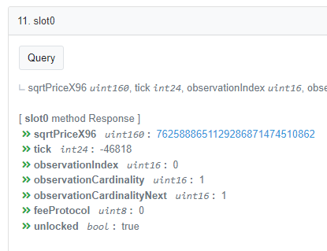{height="50%" width="50%"}

The sqrtPriceX96 is the price in unsigned integer 160 bit form. The first 64 bits are the integer, the next
96 are the fractional part. `price_to_sqrtpx96()` and `sqrtpx96_to_price()` are available for smoothly
converting between these forms. 

As noted previously, different math sources and different pools freely switch between pricing in X/Y and Y/X form.
When you convert a sqrtpX96 to a standard price, be aware of what pool you are using and be prepared to 
invert prices (e.g., mutiplying ticks by -1) to ensure things are making sense at the *pool* level.

Some Uni v3 pools will have ticks as positive numbers, others as negative numbers. This is all a result
of how they choose token0 (X) and token1 (Y); some pools alphabetize the token contract address, others 
are configured based on the pool creator's input. 

This is troublesome, but functions have been prepared to accept `yx = TRUE` or `yx = FALSE` parameters
to handle them according to what the user thinks is more logical for understanding the pool.

```{r, warn = FALSE, message = FALSE}
library(gmp) # large numbers library 

price_to_sqrtpx96 <- function(P){
  # Uniswap stores prices as square roots in 64.96 (64 bits integer, 96 bit fractional)
  # assume sqrt price is a rational and use gmp big integer
  
  gmp::as.bigq(sqrt(P)) * gmp::as.bigz(2)^96
  
}

sqrtpx96_to_price <- function(sqrtpX96){
  p <- as.bigq(sqrtpX96)/(as.bigz(2)^96)
  
  # expect a small amount of precision loss, it's unavoidable.
  as.numeric(p^2)
}

```

Using `sqrtpx96_to_price()` to convert 7625888651129286871474510862 to price, we can
see it matches the tick -46818. 

```{r}
reactable(
  data.frame(
  "sqrtpx96_price" = sqrtpx96_to_price('7625888651129286871474510862'),
  "tick_price" = tick_to_price(-46818)
  )
)
```

These prices coincide with Y/X pricing, where token 0 (X) is LINK, and token 1 (Y) is MKR. Thus,
these are MKR / LINK prices.

As you work with Uni v3, you will notice that precision is regularly lost. Generally,
these functions will be within 0.005% of each other if not even closer. 

### Note on Decimal Adjustment

Note: This was easy to do given that MKR and LINK both have the same amount of decimals.
When pools don't have the same amount of decimals (e.g., a USDC/ETH pool) decimal adjustments (and 
careful understanding of whether pricing is X/Y or Y/X) are important to confirm a logical result. 

For illustrative purposes consider the USDC (6 decimal) / WETH (18 decimal) pool. 
At time of snapshot, ETH was ~$1351.

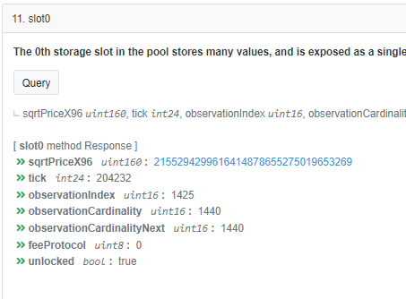{height="50%" width="50%"}

To get this logical output requires understanding that this pool is in ETH/USDC format and that there is 
a decimal difference between these coins. 

`sqrtpx96_to_price('2155294299616414878655275019653269')` returns 740,037,952.
```{r}
reactable(
  data.frame(
    "raw_price" = sqrtpx96_to_price('2155294299616414878655275019653269')
  )
)
```

This is (1) not decimal adjusted, divide by 1e12 (18 decimals - 6 decimals = 12 decimals). 
And then inverse to get the human readable 1,351 USDC per ETH. Note the tick price and sqrtpx96 
prices lose some precision but are very close (within 0.003%). 

```{r}
reactable(
  data.frame(
      "tick_price" = tick_to_price(204232),
    "px96_price" = sqrtpx96_to_price('2155294299616414878655275019653269'),
    "px96_adjust_decimals" = sqrtpx96_to_price('2155294299616414878655275019653269')/1e12,
    "invert_adjusted" = (sqrtpx96_to_price('2155294299616414878655275019653269')/1e12)^-1
  )
)
```

## Tracking Liquidity

Here, the liquidity of the proxy pool (MKR/LINK on Optimism) is 343,255,264,548,669,212.

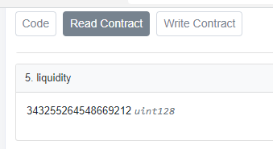{height="50%" width="50%"}

This is easier to understand because we know in advance this pool has a *single* position. The 
-50100 to -39120 range seeded. Thus, the liquidity of the pool and the liquidity provided by this 
position are the same.

As we will see later when calculating swaps in complex pools, pools with more than one (*live*) position
will have more significantly more liquidity. 

To calculate this contract level liquidity, we use `get_liquidity()` and provide all 
the relevant information in its most contract level form, i.e., we adjust our tokens by their decimal values.

For ETH we would use wei (1 ETH = 1e18 wei); and for ERC20 tokens like MKR and LINK we also use 1e18.
Knowing that these numbers are very large, we will use the `gmp` package to handle arbitrarily large numbers.

- x = 1.139289230675491064 * 1e18 LINK (this is the exact amount at the smallest available unit).
- y = 0.005 * 1e18 MKR
- P = 0.009264495 Y/X taken from the contract sqrtPriceX96. 
- pa, min_tick = -50100
- pb, max_tick = -39120

Liquidity is calculated based on position(s) being *live*. If a position is entirely out of range, 
it is 100% in 1 asset, and is thus not earning fees nor providing liquidity. When the 
price P is between min price pa and max price pb, you calculate liquidity as the *minimum* of 
the liquidity provided by asset X and the liquidity provided by asset Y relative to the current price.

This avoids some issues with precision, submitting tokens in a block that may contain 
transactions that change the price of the pool within the same block, and some attack 
vectors on manipulating liquidity and the geometric oracle built into Uni v3.

```{r}

get_liquidity <- function(x, y, P, pa, pb, yx = TRUE){ 
  
  # if prices are in Y/X format, invert them and act as X/Y
  if(yx == FALSE){
    return(get_liquidity(x, y, P = P^-1, pa = pb^-1, pb = pa^-1, yx = TRUE))
  }
  
  # include minimum of Lx and Ly as done in contract

  # formal math in Uni v3 implemented w/ sqrt px96 price formats 

getLiq_amount0 <- function(mintickx96, maxtickx96, amount0){
    if( mintickx96 >  maxtickx96){
        temp = mintickx96
        mintickx96 <- maxtickx96
        maxtickx96 <- temp
    }
    intermediate = mintickx96*maxtickx96/as.bigz(2^96)
    
    return(amount0*intermediate / (maxtickx96 - mintickx96))
}

getLiq_amount1 <- function(mintickx96, maxtickx96, amount1){
    if( mintickx96 >  maxtickx96){
        temp = mintickx96
        mintickx96 <- maxtickx96
        maxtickx96 <- temp
    }
    
    return(amount1*as.bigz(2^96)/(maxtickx96 - mintickx96))
}

getLiq <- function(current_pricex96, mintickx96, maxtickx96, amount0, amount1){
    if( mintickx96 >  maxtickx96){
        temp = mintickx96
        mintickx96 <- maxtickx96
        maxtickx96 <- temp
    }
    
    if(current_pricex96 <= mintickx96){
        liq = getLiq_amount0(mintickx96, maxtickx96, amount0)
    } else if (current_pricex96 < maxtickx96){
        liq0 <- getLiq_amount0(current_pricex96, maxtickx96, amount0)
        liq1 <- getLiq_amount1(mintickx96, current_pricex96, amount1)
        
        #ifelse() cannot handle subassignment of big rationals 
        if(liq0 < liq1){
          liq <- liq0
        } else {
          liq <- liq1
        }
        
    } else { 
        liq = getLiq_amount1(mintickx96, maxtickx96, amount1)
    }
    
    return(liq)
    
}

# always return integer 
Lx = as.bigz(getLiq_amount0(mintickx96 = price_to_sqrtpx96(pa), 
                    maxtickx96 = price_to_sqrtpx96(pb), 
                    amount0 = x))

Ly = as.bigz(getLiq_amount1(mintickx96 = price_to_sqrtpx96(pa), 
                    maxtickx96 = price_to_sqrtpx96(pb), 
                    amount1 = y))

L = as.bigz(getLiq(current_pricex96 = price_to_sqrtpx96(P), 
              mintickx96 = price_to_sqrtpx96(pa),
              maxtickx96 = price_to_sqrtpx96(pb),
              amount0 = x,
              amount1 = y))
  
return(L)
}

```

```{r}
x = as.bigz('1139289230675491064') # exact amount integer form LINK, token 0
y = as.bigz(0.005*1e18) # exact amount integer form MKR, token 1
# sqrtPriceX96 uint160:  7625888651129286871474510862
P = 0.009264495 # taken from contract sqrtPriceX96  
min_tick <- -50100 
max_tick <- -39120
pa = tick_to_price(min_tick) # price in x/y format 
pb = tick_to_price(max_tick)

liquidity <- get_liquidity(x = x, y = y, P = P, pa = pa, pb = pb, yx = TRUE)

reactable(
  data.frame(
  actual_liquidity = "343255264548669212",
calculated_liquidity = as.character(liquidity), # can't data frame Big Ints
 actual_div_calculated = as.numeric(as.bigq(liquidity)/as.bigq("343255264548669212"))
  )
)
```

Again, precision is lost due to how Price was provided as a decimal and large integers are used here.
But they are within 0.000005% of each other.

## Swap within a Tick

The liquidity `r liquidity` is the amount of active liquidity among all relevant positions- here, just one.

The current price tick from the contract is -46818.
That means the current range is starts at the nearest tick spacing before -46818: 

-46860 to -46800.

```{r}
tick_spread <- seq(min_tick, max_tick, by = 60)
current_tick <- -46818 # from contract 
preceding_tick <- -46860
next_tick <- -46800

```

This current tick range corresponds to prices: 

```{r}
reactable(
  data.frame(
    "tick" = c("preceding","current","next"),
    "tick_val" = c(preceding_tick, current_tick, next_tick),
    "price" = tick_to_price(c(preceding_tick, current_tick, next_tick))
  )
)

```

To calculate a swap that does *not* result in a change of active ticks (which could change 
liquidity) we use the available liquidity and the amount of X provided (i.e., added to the pool) to calculate the effect in price.

This effect in price then allows for calculation of how much Y is returned (i.e., removed from the pool).

Purposefully doing a very small swap of `dx = 0.000000030675491064 LINK` results in the same liquidity 
but a new price and an output of `dy = -0.000000000283340352354316 MKR`. Notice it is negative because 
this MKR is *removed* from the liquidity pool. The 0.3% fee is taken out upfront, such that the pool 
experiences a change of `0.00000003058346 LINK` and the liquidity provider (i.e., the single position)
earns `0.000000000092026473192 LINK`. Adding these back together equals the LINK removed from the seller.

Notice the price change from `762588864...` to `762588858...` By giving the pool LINK and removing MKR from the pool (i.e., selling LINK), the price in MKR/LINK decreases: 1 LINK gets less MKR.

```{r}

swap_within_tick <- function(L, sqrtpx96, dx = NULL, dy = NULL, 
                             decimal_x = 1e18,
                             decimal_y = 1e18, 
                             fee = 0.003){
  # Change in price = Delta(Y) / L 
  # change in Inverse(Price) = Delta(X)/L
  
  # price in *square root* 64.96 form 
  L = as.bigz(L)
  P = as.bigz(sqrtpx96)
  c96 = (as.bigz(2)^96)
  # inverse price
  iP = P^-1
  
  # adjust real dx or dy to 96 int & adjust for fees
  if(!is.null(dx)){
    dxa <- as.bigq(dx) * (1 - fee) * decimal_x / c96
  }
  if(!is.null(dy)){
    dya <- as.bigq(dy) * (1 - fee) * c96 * decimal_y
  }
  
  r = list(
    liquidity = L,
    dx = NULL,
    dy = NULL,
    price1 = P,
    price2 = NULL,
    fee = NULL
  )
  
  if(is.null(dx) & is.null(dy)){
    stop("A change in x or y is required to use liquidity")
  }
  
  if(!is.null(dx) & !is.null(dy)){
    stop("Only 1 swap can be noted")
  }
  
  if(!is.null(dx)){
    # iP_new - iP = dx/L
    # iP_new = dx/L + iP
    
    iP_new = dxa/L + iP
    P_new = iP_new^-1
    
    # dy = (P_new - P)*L
    dya = (P_new - P)*L
    
    # convert back to real units 
    dyz = as.numeric( dya / c96 ) / decimal_y
    
    r$dx = dx * (1 - fee)
    r$dy = dyz
    r$price2 <- as.bigz(P_new)
    r$fee = fee * dx
    
  } else if(!is.null(dy)){
    # dy =  (P_new - P)*L
    # P_new = dy/L + P 
    
    P_new = dya/L + P 
    
    iP_new = P_new^-1
    
    dxa = (iP_new - iP)*L
    
    # convert to real units 
    dxz = as.numeric(dxa * c96) / decimal_x
    
    r$dx <- dxz 
    r$dy <- dy * (1 - fee)
    r$price2 <- as.bigz(P_new)
    r$fee <- fee * dy
  }
  
  return(r)
  
}

swap_xy <- swap_within_tick(L = liquidity,
                 sqrtpx96 = price_to_sqrtpx96(P), 
                 dx = 0.000000030675491064, dy = NULL)

reactable(
  data.frame(
    'liquidity' = as.character(swap_xy$liquidity), 
    'dx' = as.character(swap_xy$dx),
    'dx_fee' = as.character(swap_xy$fee),
    'dx_plus_fee' = as.character(swap_xy$dx + swap_xy$fee),
    'dy' = as.character(swap_xy$dy),
    'initial_price' = as.character(swap_xy$price1),
    'final_price' = as.character(swap_xy$price2)
  )
)

```

This perfectly aligns to the real world transaction on Optimism [here](https://optimistic.etherscan.io/tx/0x48bbeb4fd7e6f04950e24929314a4730a62528e6da1d61d378ad9599bf442fd6).

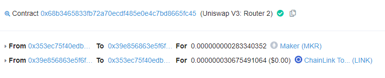{height="50%" width="50%"}

Showing the swap in reverse, adding the MKR (adjusted for fee) instead of removing it (i.e., selling MKR to the pool), shows a MKR fee of `0.000000000000852578793443278` and the pool returns `-0.00000003058346 LINK`. 
The liquidity is the same, but the final price moves in the other direction (selling MKR to the pool 
increases the amount of MKR in the pool, reducing the amount of LINK in the pool, and increases the amount of MKR per LINK; i.e., the price.)

```{r}
swap_yx <- swap_within_tick(L = liquidity,
                 sqrtpx96 = price_to_sqrtpx96(P), 
                 dx = NULL, 
                 dy = 0.000000000283340352354316/0.997)

reactable(
  data.frame(
    'liquidity' = as.character(swap_yx$liquidity), 
    'dy' = as.character(swap_yx$dy),
    'dy_fee' = as.character(swap_yx$fee),
    'dy_plus_fee' = as.character(swap_yx$dy + swap_yx$fee),
    'dx' = as.character(swap_yx$dx),
    'initial_price' = as.character(swap_yx$price1),
    'final_price' = as.character(swap_yx$price2)
  )
)
```

Notice the price change from `762588864...` to `762588871...` By giving the pool MKR and removing LINK from the pool (i.e., selling MKR), the price in MKR/LINK increases: 1 LINK gets more MKR.

## Swap across Ticks

Swaps across ticks work by using the liquidity available between the current price and 
the next tick range (i.e., the next tick given tick spacing); then re-calculating liquidity at this tick, and continuing to the next range; repeating this process until the swap is complete.

Recall that liquidity (L) and price (the square root Px96) *only change one at a time*. 
Within a tick range, the price changes and liquidity is fixed. When crossing a tick, the price pauses while liquidity is recalculated.

Said again: 

1. Given Liquidity, L; current price, P; and a desired swap, dx or dy (token 0 or token 1).
2. Calculate the swap size, DX_tick that moves the price to the next tickspacing
3a. If the desired swap size dx <= DX_tick, complete the swap and move the price to P1, leaving liquidity the same, and the swap is complete.
3b. If the desired swap size dx > DX_tick, complete part of swap (dx_leftover = dx - DX_tick) and at the new tick spacing, re-calculate Liquidity, L_new using the new price P_new at that tick spacing.
4. Given L_new, P_new, and dx_leftover, repeat steps 1-3 until 3a is reached.

The `size_price_change_in_tick()` function is used for step (2); given Liquidity and two prices (current and target) it returns the swap size needed to change the price in desired form (dx, amount of x needed or dy, amount of y needed). NOTE: This is only accurate up to the next tick spacing! This function will be used 
iteratively with `get_liquidity()` to methodically complete swaps.

Here `size_price_change_in_tick()` matches `dx_plus_fee and dy` above, to confirm the math all aligns.
Note: because fees are taken in the currency used in the swap, this returns the trade size *before* fees 
are removed. Use `swap_within_tick()` to get a breakdown of fees. 

This may make more sense when realizing to move the price a single direction implicitly requires 
fees in a single token. Calling `dx = FALSE` in our example returns a negative value. This is MKR (token 1, y)
*removed* from the pool. To remove tokens from a pool means you add the other token! It's this other 
token where fees are removed.

```{r}

# includes fee 
size_price_change_in_tick <- function(L, sqrtpx96, sqrtpx96_target, dx = TRUE, 
                              decimal_adjustment = 1e18, fee = 0.003){
 # given a liquidity and known new price, how much of a change is required to get to the new price
 # Includes fees!
  
  # price in *square root* 64.96 form 
  L = as.bigz(L)
  P = as.bigz(sqrtpx96)
  P_target = as.bigz(sqrtpx96_target)
  c96 = as.bigz(2)^96
  # inverse price
  iP = P^-1
  iP_target = P_target^-1
   
  if(dx == TRUE){
    dxa = (iP_target - iP) * L
   dx = as.bigq(dxa) / (1 - fee) / decimal_adjustment * c96
   return(as.numeric(dx))
  } else { 
    dya = (P_target - P)*L
    dy = dya / (1 - fee) / c96 / decimal_adjustment
    return(as.numeric(dy))
    }
}

# trade x, LINK 
size_price_change_in_tick(L = "343255263830421644",
                  sqrtpx96 = "7625888646051765535543132160",
                  sqrtpx96_target = '7625888580652810738255925731', 
                  dx = TRUE)
# trade y, MKR
size_price_change_in_tick(L = "343255263830421644",
                  sqrtpx96 = "7625888646051765535543132160",
                  sqrtpx96_target = '7625888580652810738255925731', 
                  dx = FALSE)

```

After the previous transaction, the pool on Optimism has a new price (note: very small <0.0001% precision loss compared to calculated target from previous example):

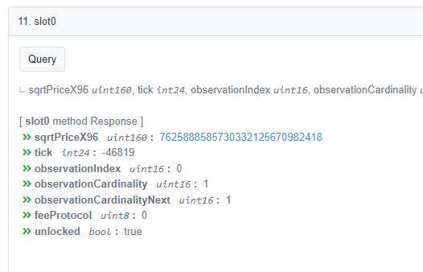{height="50%" width="50%"}

sqrtPriceX96: 7625888585730332125670982418
current tick: -46819

The ticks surrounding this price given 60 tick spacing are: 

- -46860
- -46800

```{r}
get_closest_tick(sqrtpx96_to_price("7625888585730332125670982418"))$tick + c(-60, 0)
```

Let's identify how to move the price from the current price to the -46800 tick.

```{r}

size_price_change_in_tick(L = "343255263830421644",
                  sqrtpx96 = "7625888585730332125670982418",
                  sqrtpx96_target = price_to_sqrtpx96(tick_to_price(-46800)), 
                  dx = TRUE)

```

To move the price to -46800, requires *removing* (notice the negative) (-)0.003217664 LINK (x, token 0), i.e.,
adding MKR. To keep it simple, let's assume we want to sell LINK for MKR and move price to -46860.

```{r}
size_price_change_in_tick(L = "343255263830421644",
                  sqrtpx96 = "7625888585730332125670982418",
                  sqrtpx96_target = price_to_sqrtpx96(tick_to_price(-46860)), 
                  dx = TRUE)
```

To move the price to -46860 requires *adding** (i.e., selling) (+)0.007519051 LINK (x, token 0).

This is the final tick in the range, so at this point, Liquidity will need to be recalculated.
To calculate liquidity requires knowing the amount of each token (x, y) in the pool,
the current price, and range of the position (this is still a 1 position sized pool).

First let's match how much MKR is removed by a sale of 0.007519051 LINK with `swap_within_tick()`.

```{r}

swap_within_tick(L = "343255263830421644",
                  sqrtpx96 = "7625888585730332125670982418", 
                 dx = 0.007519051)$dy

```

Adding 0.007519051 LINK from this pool removes (-)0.00006930554 MKR which exactly matches
the Uniswap main app website calculator's 0.0000693055 *Expected Output*.

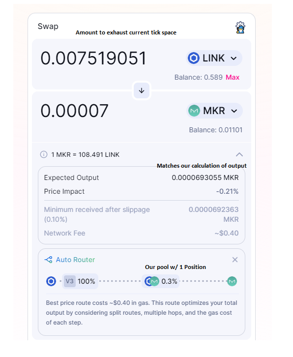{height="50%" width="50%"}

Let's complete this trade and confirm we can recalculate liquidity and price.

[This transaction](https://optimistic.etherscan.io/tx/0x411c6c3796cd0124e9af77bde51b241a0aebaac29269c6d682f30adc4b281860) shows the trade aligns to the expected input/out.

Also, we can see the price has changed to the expected tick.

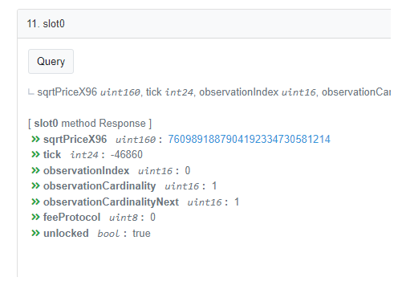{height="50%" width="50%"}

The new balances of tokens include: 

- x: 1.146808312350982128 LINK (18 decimals)
- y: 0.00493069417466594 MKR (18 decimals)
- Price: `r sqrtpx96_to_price('7609891887904192334730581214')` 
- pa, min_tick = -50100 (pool has only a single position)
- pb, max_tick = -39120 (pool has only a single position)

It turns out that with only a single position in a liquidity pool; moving across ticks doesn't change the total liquidity! So that within a single position pool; prices can be moved across ticks as if it were all within a single tick spacing.

In [this transaction](https://optimistic.etherscan.io/tx/0xec76dec1d664f4d0126513bd4ba59c3fe933086a914ac285c2b7dd038477e0de) the router used the proxy pool created for this analysis. The price moved from tick -46860 to tick -49472: 43 tick spacings! without liquidity changing.

- Original price, p1 = '7609891887904192334730581214'
- Original liquidity, l1 = '343255264548669212'
- Original tick = -46860
- Original amount of LINK, x1 = 1.146808312350982128 
- Original amount of MKR,  y1 = 0.00493069417466594
- Final amount of LINK: x2 = 1.646808312350982128
- Final amount of MKR, y2 = 0.000894686462797907

```{r}
# Original Stats 
l1 = '343255264548669212' # liquidity taken from contract
p1 = '7609891887904192334730581214'
tick1 = -46860
x1 = as.bigq(1.146808312350982128) #LINK (18 decimals)
y1 = as.bigq(0.00493069417466594) #MKR (18 decimals)

# result of random person who intersected the proxy pool
y_diff = as.bigq(-0.004036007711868033) 
x_diff = 0.5

# final balance of proxy pool 
y2 = as.bigq(0.000894686462797907) # MKR
x2 = as.bigq(1.646808312350982128) # LINK

# final liquidity and price info 
l2 = '343255264548669212' 
p2 = '6678324311438468291016353224'
tick2 = -49472

delta_link = size_price_change_in_tick(L = l2,
                          sqrtpx96 = p1,
                          sqrtpx96_target = p2, 
                          dx = TRUE)
delta_mkr = size_price_change_in_tick(L = l2,
                          sqrtpx96 = p1,
                          sqrtpx96_target = p2, 
                          dx = FALSE)

reactable(
  data.frame(
    predicted_link_delta = delta_link,
    actual_link_delta = x_diff,
    predicted_mkr_delta = delta_mkr,
    actual_mkr_delta = as.numeric(y_diff)
  )
)

```


## Multiple Liquidity Positions 

Adding 2 more active positions to confirm cross-liquidity position swaps. 

The current tick price is (roughly) -49472; with a specific price of 0.0071050192 MKR/LINK; 
or in px96 form `6678324311438468291016353224`.

```{r}
position_tbl <- data.frame(
    position = c(0,1,2),
    min_tick = c(-50100, -60000, -50100),
    max_tick = c(-39120, -49020, -46080)
  )

reactable(
position_tbl  
)

```

For simplicity let's match 0.00005 MKR to each of these ranges and see how much LINK is required to match them.

```{r}
position_tbl$min_price <- tick_to_price(position_tbl$min_tick)
position_tbl$price <- sqrtpx96_to_price('6678324311438468291016353224')
position_tbl$max_price <- tick_to_price(position_tbl$max_tick)
position_tbl$mkr <- c(0.0008946,0.00005, 0.00005)
position_tbl$link <- c(NA,NA,NA)

for(i in 1:3){
  position_tbl$link[i] <- {
    match_tokens_to_range(x = NULL, 
                          y = position_tbl$mkr[i], 
                          P = 0.00710519,
                          pa = tick_to_price(position_tbl$min_tick[i]),
                          pb = tick_to_price(position_tbl$max_tick[i]))$amount_x
  }
}

reactable(
position_tbl  
)

```

Notice that the current balance of our original position 0.0008946 MKR matches correctly 
to 1.645136 LINK that is in the contract prior to adding new positions.

### Calculating Liquidity 

The liquidity of the pool is now: `363887625690661420`. This is the sum all of three
*active* positions.

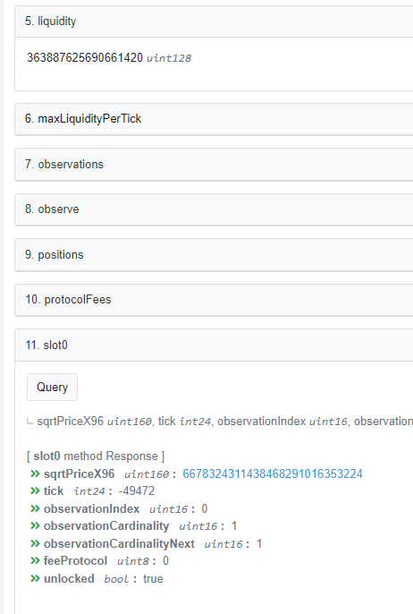{height="50%" width="50%"}


```{r}

position_tbl$liquidity <- 0

for(i in 1:nrow(position_tbl)){
  # Not conversion to integer unit 18 decimals
  # and that our price  `6678324311438468291016353224` is already in normal form
  position_tbl$liquidity[i] <- as.character(get_liquidity(x = as.bigz(position_tbl$link[i]*1e18), 
                                             y = as.bigz(position_tbl$mkr[i]*1e18),
                                             P = position_tbl$price[i],
                                             pa = position_tbl$min_price[i],
                                             pb = position_tbl$max_price[i], 
                                             yx = TRUE))
  
}

reactable(
  position_tbl
)

```

The sum of this liquidity is `r sum(as.bigz(position_tbl$liquidity))` which, due to some
precision loss, is 0.009% off the formal contract, within tolerance.

## Swaps within all active positions

As shown previously in the single-position swaps; liquidity and price only change one 
at a time. So swaps can be treated as occurring within a single tick until a position is out of range, at which point, liquidity will need to be re-calculated.

Let's calculate a 0.0005 MKR sale into this 0.3% pool.

### Identify next re-calculate tick 

First, we must identify, what price *would* require a recalculation. 

Selling MKR *increases* the MKR/LINK price (each LINK gets MORE MKR). The current price is `0.007105192....` the closest **higher** price across all positions is at tick `-49020` or price `0.007433526...`.

The `find_recalculation_price()` function takes a table of positions, the current price, and 
the direction of the trade to identify which price requires a re-calculation of liquidity.

```{r}
find_recalculation_price <- function(positions, current_price, price_up = TRUE){ 

  p <- positions[, c("min_price","max_price")]
  
  # if price going up, get the closest available price above current price
  if(price_up == TRUE){
     closest_price <- p[p > current_price][which.min(p[p > current_price])]
    } else { 
    closest_price <- p[p < current_price][which.max(p[p < current_price])]
    }
  
  return(closest_price)
}

recalculation_price <- find_recalculation_price(position_tbl, position_tbl$price[1], price_up = TRUE)

```

Using the recalculation_price and `size_price_change_in_tick()` allows us to identify the max number of tokens can that can be added/removed before liquidity must be recalculated.

```{r}
simulated_L = sum(as.bigz(position_tbl$liquidity))
actual_L = as.bigz("363887625690661420")

max_mkr <- size_price_change_in_tick(L = simulated_L, 
                          sqrtpx96 = as.bigz("6678324311438468291016353224"),
                          sqrtpx96_target = price_to_sqrtpx96(recalculation_price),
                          decimal_adjustment = 1e18, 
                          fee = 0.003, 
                          dx = FALSE)

max_link <- size_price_change_in_tick(L = simulated_L, 
                          sqrtpx96 = as.bigz("6678324311438468291016353224"),
                          sqrtpx96_target = price_to_sqrtpx96(recalculation_price),
                          decimal_adjustment = 1e18, 
                          fee = 0.003, 
                          dx = TRUE)

reactable(
  data.frame(
    "max MKR before Recalc" = max_mkr,
    "max LINK before Recalc" = max_link, check.names = FALSE
  )
)

```

We can *add* up to 0.0007... MKR to the pool before recalculating liquidity; alternatively we 
can *remove* (note the minus sign) a maximum of 0.09669... LINK before recalculating liquidity (both actions increase the MKR/LINK price to our specified target!)

Since 0.0005 is smaller than 0.000700637157102397 we can sell 0.0005 MKR to this pool without changing the available liquidity

A swap of 0.0005 treated as within a tick would result in: 

- a 0.3% fee (0.0000015 MKR) paid to the position owners
- an net addition of 0.0004985 MKR to the pool
- A removal of 0.0690378... LINK from the pool 
- a new price `6786871118106667576390211352` 

```{r}
mkr_sale <- swap_within_tick(L = simulated_L,
                 sqrtpx96 = as.bigz("6678324311438468291016353224"),
                 dx = NULL,
                 dy = 0.0005, fee = 0.003)
reactable(
   data.frame(
    'liquidity' = as.character(mkr_sale$liquidity), 
    'dy' = as.character(mkr_sale$dy),
    'dy_fee' = as.character(mkr_sale$fee),
    'dy_plus_fee' = as.character(mkr_sale$dy + mkr_sale$fee),
    'dx' = as.character(mkr_sale$dx),
    'initial_price' = as.character(mkr_sale$price1),
    'final_price' = as.character(mkr_sale$price2)
  )
)

```

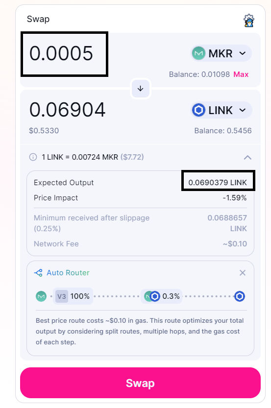{height="50%" width="50%"}

Completing this trade will distribute the 0.0000015 MKR among the positions proportional 
to their *liquidity* provided.

```{r}
position_tbl$liq_share <-  round(as.numeric(
  as.bigz(position_tbl$liquidity)/sum(as.bigz(position_tbl$liquidity))
), 18)

position_tbl$mkr_fee_accrued <- position_tbl$liq_share*0.0000015

reactable(
  position_tbl[,c("position","min_tick","max_tick","liquidity", "liq_share", "mkr_fee_accrued")]
)

```

Compare this to the actual amounts collected for each position:

- Position 0 [confirmation link](https://optimistic.etherscan.io/tx/0x76e0002ac5f7480c612b5e07bff546567814eb286244ae3f427621d437128fbd)

- Position 1[confirmation](https://optimistic.etherscan.io/tx/0xa63d01a0f9b2959a857a661c296606bee6b4cc8860ccaaab16136fd29c8f26b1)

- Position 2 [confirmation](https://optimistic.etherscan.io/tx/0x308cf68161bd67f3d2f1032d6b5b222f1fb15e73e082103cc4a5a3c76343d8e9)

```{r}
reactable(
  data.frame(
    position = c(0,1,2),
    mkr_fee_estimated = position_tbl$mkr_fee_accrued,
    mkr_fee_actual = c(0.000001414950277151,
                       0.000000005974519635,
                       0.000000079075203212)
  )
)

```

## Swaps across active positions 

We now have all the components required to identify swap prices and fees paid across
liquidity providers given a set of available liquidity. The final step is to perform swaps
where liquidity must *change* mid-swap.

With the available components this is now easy: 

1. Given a set of liquidity and a desired swap amount (and direction), calculate the the 
recalculation_price: the price at which liquidity must be recalculated.
2. If the swap would exceed that recalculation price, swap *up to* that price
and distribute the fees (so far) across available liquidity. Otherwise proceed as if in 1 large tick.
3. Pause with the excess swap amount, and re-calculate liquidity given new active positions.
4. Repeat 1-3 given new liquidity(s).

Recall the current positions and their ranges, with the updated current price: 

```{r}
position_tbl_final <- position_tbl[, c("position", "min_price","price", "max_price","liquidity")]
position_tbl_final$price <- sqrtpx96_to_price(mkr_sale$price2)

reactable(
  position_tbl_final
)

```

Let's consider a a trade that goes beyond position 1; where the max price is `0.0074335...`.
For example, a sale of 0.0005 MKR again (which will *increase* the price, i.e. more MKR per LINK).

1. Given a set of positions, identify which are *active*

```{r}
current_price <- position_tbl_final$price[1]

active <- logical(nrow(position_tbl_final))

for(i in 1:nrow(position_tbl_final)){
if(current_price >= position_tbl_final$min_price[i] & 
   current_price <= position_tbl_final$max_price[i]){
  active[i] <- TRUE
}
}
position_tbl_final$active <- active 

reactable(
  position_tbl_final
)

```

2. Given a swap direction (here price going up, i.e. MKR per LINK will go up because we are 
selling MKR to the pool) identify the next price that will change our active positions (and thus cause
liquidity to be recalculated).

```{r}
recalc_price <-find_recalculation_price(positions = position_tbl_final, 
                                        current_price = current_price, 
                                        price_up = TRUE)
```

3. With this price, identify the max swap size available before recalculation using the 
*active* liquidity.

```{r}
active_L = sum(as.bigz(position_tbl_final$liquidity[position_tbl_final$active]))

recalc_amt_mkr = size_price_change_in_tick(L = active_L, 
                          sqrtpx96 = price_to_sqrtpx96(current_price), 
                          sqrtpx96_target = price_to_sqrtpx96(recalc_price), 
                          dx = FALSE, # return mkr to sell
                          fee = 0.003)

reactable(
  data.frame(
    liquidity = as.character(active_L),
    price = current_price, 
    recalc_price = recalc_price,
    mkr_to_sell = recalc_amt_mkr
  )
)

```

4. Perform a swap of the defined size. Distribute fees across the active positions. Update the price to the recalc 
price.

```{r}
leftover_mkr <- 0.0005 - recalc_amt_mkr 
fee_tbl <- position_tbl_final
fee <- recalc_amt_mkr * 0.003
fee_tbl$mkr_fees = 0 
mkr_fees <- as.numeric(fee * as.bigq(fee_tbl$liquidity) / sum(as.bigq(fee_tbl$liquidity)))
fee_tbl$mkr_fees <- fee_tbl$mkr_fees + mkr_fees

fee_tbl$price <- recalc_price

reactable(
  fee_tbl
)

```

5. Update the liquidity active status knowing that price is going up so we compare max price.

```{r}

fee_tbl$active <- !(fee_tbl$price >= fee_tbl$max_price)

reactable(
  fee_tbl
)

```

6. Find the next recalc price and identify how much MKR would be sold to get to that price.

```{r}

updated_position_tbl <- position_tbl_final[fee_tbl$active, ]

recalc_price <- find_recalculation_price(positions = updated_position_tbl, 
                                        current_price = fee_tbl$price[1], 
                                        price_up = TRUE)
active_L <- sum(as.bigz(updated_position_tbl$liquidity))

current_price = fee_tbl$price[1]
recalc_amt_mkr2 = size_price_change_in_tick(L = active_L, 
                          sqrtpx96 = price_to_sqrtpx96(current_price), 
                          sqrtpx96_target = price_to_sqrtpx96(recalc_price), 
                          dx = FALSE, # return mkr to sell
                          fee = 0.003)

reactable(
  data.frame(
     liquidity = as.character(active_L),
    price = current_price, 
    recalc_price = recalc_price,
    mkr_to_sell = recalc_amt_mkr2,
    leftover_mkr = leftover_mkr
  )
)

```

Here, we can see the leftover amount 0.00297 MKR is less than the MKR needed to reach the next recalc price. So we are almost done.

7. Perform a swap of the defined size. Distribute fees across the active positions. Update the price to new price.

```{r}

fee <- leftover_mkr * 0.003
mkr_fees <- as.numeric(fee * as.bigq(fee_tbl$liquidity) * fee_tbl$active / 
                         sum( as.bigq(fee_tbl$liquidity)*fee_tbl$active )
                       )
fee_tbl$mkr_fees <- fee_tbl$mkr_fees + mkr_fees


new_price <- swap_within_tick(L = active_L, sqrtpx96 = price_to_sqrtpx96(current_price), dy = leftover_mkr, fee = 0.003)$price2

fee_tbl$price <- sqrtpx96_to_price(new_price)
reactable(
  fee_tbl
)

```

We can confirm the swap all adds up by summing the fees and dividing by the fee rate; and also get the total amount of LINK removed by changing the liquidity mid swap.

```{r}

L1 <- sum(as.bigz(position_tbl_final$liquidity))
L2 <- sum(as.bigz(updated_position_tbl$liquidity))

link1 <- swap_within_tick(L = L1, 
                          sqrtpx96 = price_to_sqrtpx96(position_tbl_final$price[1]),
                          dy = recalc_amt_mkr, fee = 0.003)$dx
link2 <- swap_within_tick(L = L2,
                          sqrtpx96 = price_to_sqrtpx96(current_price) , 
                          dy = leftover_mkr, fee = 0.003)$dx

reactable(
  data.frame(
    total_mkr_fees = sum(fee_tbl$mkr_fees),
    total_mkr_sold = sum(fee_tbl$mkr_fees)/0.003,
    total_link_received = abs(link1 + link2),
    original_price = position_tbl_final$price[1],
    final_price =  sqrtpx96_to_price(new_price),
    avg_price = 0.0005/abs(link1 + link2)
  )
)

```

## Validation 

Given the initial status of the proxy pool on Optimism with contract level data identified 
with perfect precision, let's confirm a real sale of 0.0005 MKR will match the expected results.

- Current Price: 

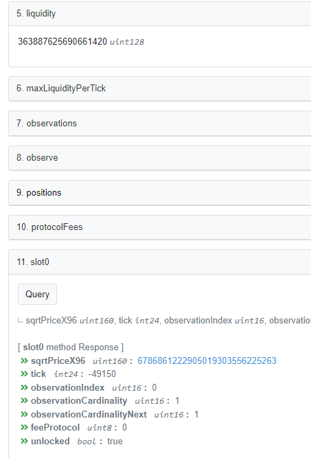{width="50%"}

Our estimated liquidity is within 0.009% of actual (this is due to differences in discrete math and lack of usage of Chinese Remainder Theorem in the R implementation causing precision loss).

```{r}
validation_initial <- position_tbl[, c("position", "min_tick", "max_tick", 
                                       "min_price", "max_price",
                                       "liquidity")]
reactable(
  data.frame(
    estimated_div_actual_liq = as.numeric(
      sum(as.bigz(validation_initial$liquidity)) / as.bigz('363887625690661420')
    )
  )
)

```

Using the exact price provided by the contract shows this validation position table:

```{r}
contract_price <- sqrtpx96_to_price('6786861222905019303556225263')

validation_positions <- validation_initial %>% mutate(
    active = ifelse(contract_price >= min_price & contract_price <= max_price, TRUE, FALSE)
)

reactable(
  validation_positions
)

```

Combining past checks to create the following functions: 

- `check_positions()`: updates a position table's active flag to filter available liquidity for a given price.
- `swap_across_ticks()`: Give a position table and a desired swap size, it iterates through identifying the recalculation price, swapping to that price, checking the positions, and restarting until the swap is complete. It returns a `trade_record` list of the results.

```{r}

check_positions <- function(ptbl, P){
  if( !("min_price" %in% colnames(ptbl)) | !("max_price" %in% colnames(ptbl))){
    stop("Cannot find min_price and max_price columns.")
  }
  
  ptbl <- ptbl %>% mutate(
    active = ifelse(P > min_price & P < max_price, TRUE, FALSE)
  )
  return(ptbl)
}

swap_across_ticks <- function(ptbl, sqrtpx96, 
                              fee_tbl = NULL, 
                              trade_record = NULL,
                              dx = NULL, 
                              dy = NULL, 
                              decimal_x = 1e18, 
                              decimal_y = 1e18, 
                              fee = 0.003){
  
  if(is.null(dx) & is.null(dy)){
    stop("A change in x or y is required to use liquidity")
  }
  
  if(!is.null(dx) & !is.null(dy)){
    stop("Only 1 swap can be done at a time")
  }
  
  # if dx is null; we're selling dy, which means price is going up! 
  # (P = Y/X; more Y is more P)
  if(is.null(dx)){
    
    amount <- dy
    price <- sqrtpx96_to_price(sqrtpX96 = sqrtpx96)
    update_ptbl <- check_positions(ptbl, price)
    
    
    # record fees separately 
    # if it is blank assume this is a fresh swap and make the fee tbl
    if(is.null(fee_tbl)){
      fee_tbl <-  update_ptbl[, c("position","liquidity", "active")]
      fee_tbl$yfee <- 0
      
      # otherwise refresh the active positions but retain any previous fee
    } else { 
      yfee = fee_tbl$yfee
      fee_tbl <-  update_ptbl[,c("position","liquidity", "active")]
      fee_tbl$yfee <- yfee
    }
    
    recalc_price <- find_recalculation_price(positions = update_ptbl, 
                                             current_price = price, 
                                             price_up = TRUE)
    
    # sum liquidity in active positions 
    current_L <- sum(as.bigz(update_ptbl$liquidity[update_ptbl$active]))  
    
    # maximum change without recalc
    max_y <- size_price_change_in_tick(
      L = current_L, 
      sqrtpx96 = sqrtpx96, 
      sqrtpx96_target = price_to_sqrtpx96(recalc_price), 
      dx = FALSE, # return dy to sell
      decimal_adjustment = decimal_y,
      fee = fee)
    
    # if you can sell without recalculation; swap within tick 
    if(max_y >= amount){
      
      swap = swap_within_tick(L = current_L,
                              sqrtpx96 = price_to_sqrtpx96(price), 
                              dy = amount, 
                              decimal_x = decimal_x, 
                              decimal_y = decimal_y, 
                              fee = fee)
      
      # attribute fees to positions 
      new_fees <- as.numeric(
        swap$fee * fee_tbl$active * as.bigq(fee_tbl$liquidity) / 
          sum(as.bigq(fee_tbl$liquidity)[fee_tbl$active])
      )
      
      # If no previous trade record is provided make a new one and return it
      # this was a swap within a tick, not across them.
      if(is.null(trade_record)){
        
        fee_tbl$yfee = fee_tbl$yfee + new_fees
        
        trade_record <- list(
          ptbl = update_ptbl,
          new_price = swap$price2,
          dy_in = swap$dy,
          dy_fee = swap$fee,
          dx_out = swap$dx,
          fee_tbl = fee_tbl
        )
      } else { 
        
        # get the original trade record and original fee_tbl 
        tr = trade_record 
        ft = trade_record$fee_tbl
        
        # add previous fees from record to latest fees and active positions
        fee_tbl$yfee = ft$yfee + new_fees
        
        # update accordingly
        trade_record <- list(
          ptbl = update_ptbl,
          new_price = swap$price2,
          dy_in = tr$dy_in + swap$dy,
          dy_fee = tr$dy_fee + swap$fee,
          dx_out = tr$dx_out + swap$dx,
          fee_tbl = fee_tbl
        )
      }
      
      # you're done; return the results.
      return(trade_record)
      
      
      # else swap as much as you can and repeat process
    } else { 
      
      leftover = amount - max_y
      
      # swap max y 
      # track leftover 
      swap = swap_within_tick(L = current_L, 
                              sqrtpx96 = price_to_sqrtpx96(price), 
                              dy = max_y, 
                              decimal_x = decimal_x, 
                              decimal_y = decimal_y, 
                              fee = fee)
      
      # attribute fees to position
        new_fees <- as.numeric(
        swap$fee * fee_tbl$active * as.bigq(fee_tbl$liquidity) / 
          sum(as.bigq(fee_tbl$liquidity)[fee_tbl$active])
      )
      
      
      # UPDATE past trade record if it exists 
      # or make new one
      
      if(is.null(trade_record)){
        
        fee_tbl$yfee = fee_tbl$yfee + new_fees
        
        trade_record <- list(
          ptbl = update_ptbl,
          new_price = swap$price2,
          dy_in = swap$dy,
          dy_fee = swap$fee,
          dx_out = swap$dx,
          fee_tbl = fee_tbl
        )
      } else { 
        # get the original trade record and original fee_tbl 
        tr = trade_record 
        ft = trade_record$fee_tbl
        
        # add previous fees from record to latest fees and active positions
       fee_tbl$yfee = ft$yfee + new_fees
        
        # update accordingly
        trade_record <- list(
          ptbl = update_ptbl,
          new_price = swap$price2,
          dy_in = tr$dy_in + swap$dy,
          dy_fee = tr$dy_fee + swap$fee,
          dx_out = tr$dx_out + swap$dx,
          fee_tbl = fee_tbl
        )
      }
      
      # call the function again with new information including *adding* trade records
      # until the final trade_record is output
      swap_across_ticks(ptbl = trade_record$ptbl,
                        sqrtpx96 = trade_record$new_price, 
                        fee_tbl = trade_record$fee_tbl, 
                        trade_record = trade_record,
                        dx = NULL, 
                        dy = leftover, 
                        decimal_x = decimal_x, 
                        decimal_y = decimal_y, 
                        fee = fee)
      
      
    }
  } else if(is.null(dy)){ 
    amount <- dx
    price <- sqrtpx96_to_price(sqrtpX96 = sqrtpx96)
    update_ptbl <- check_positions(ptbl, price)
    
    
    # record fees separately 
    # if it is blank assume this is a fresh swap and make the fee tbl
    if(is.null(fee_tbl)){
      fee_tbl <-  update_ptbl[, c("position","liquidity", "active")]
      fee_tbl$xfee <- 0
      
      # otherwise refresh the active positions but retain any previous fee
    } else { 
      xfee = fee_tbl$xfee
      fee_tbl <-  update_ptbl[,c("position","liquidity", "active")]
      fee_tbl$xfee <- xfee
    }
    
    # else we're selling dx, price is going down 
    # (P = Y/X, more X is less P)
    recalc_price <- find_recalculation_price(positions = update_ptbl, 
                                             current_price = price, 
                                             price_up = FALSE)
    
    # sum liquidity in active positions 
    current_L <- sum(as.bigz(update_ptbl$liquidity[update_ptbl$active]))  
    
    # maximum change without recalc
    max_x <- size_price_change_in_tick(
      L = current_L, 
      sqrtpx96 = sqrtpx96, 
      sqrtpx96_target = price_to_sqrtpx96(recalc_price), 
      dx = TRUE, # return dx to sell
      decimal_adjustment = decimal_y,
      fee = fee)
    
    # if you can sell without recalculation; swap within tick 
    if(max_x >= amount){
      
      swap = swap_within_tick(L = current_L,
                              sqrtpx96 = price_to_sqrtpx96(price), 
                              dx = amount, 
                              decimal_x = decimal_x, 
                              decimal_y = decimal_y, 
                              fee = fee)
      
      # attribute fees to positions 
     new_fees <- as.numeric(
        swap$fee * fee_tbl$active * as.bigq(fee_tbl$liquidity) / 
          sum(as.bigq(fee_tbl$liquidity)[fee_tbl$active])
      )
      
      # If no previous trade record is provided make a new one and return it
      # this was a swap within a tick, not across them.
      if(is.null(trade_record)){
        
       fee_tbl$xfee = fee_tbl$xfee + new_fees

        trade_record <- list(
          ptbl = update_ptbl,
          new_price = swap$price2,
          dx_in = swap$dx,
          dx_fee = swap$fee,
          dy_out = swap$dy,
          fee_tbl = fee_tbl
        )
      } else { 
        
        # get the original trade record and original fee_tbl 
        tr = trade_record 
        ft = trade_record$fee_tbl
        
        # add previous fees from record to latest fees and active positions
        fee_tbl$xfee = ft$xfee + new_fees
        
        # update accordingly
        trade_record <- list(
          ptbl = update_ptbl,
          new_price = swap$price2,
          dx_in = tr$dx_in + swap$dx,
          dx_fee = tr$dx_fee + swap$fee,
          dy_out = tr$dy_out + swap$dy,
          fee_tbl = fee_tbl
        )
      }
      
      # you're done; return the results.
      return(trade_record)
      
      
      # else swap as much as you can and repeat process
    } else { 
      
      leftover = amount - max_x
      
      # swap max x 
      # track leftover 
      swap = swap_within_tick(L = current_L, 
                              sqrtpx96 = price_to_sqrtpx96(price), 
                              dx = max_x, 
                              decimal_x = decimal_x, 
                              decimal_y = decimal_y, 
                              fee = fee)
      
      # attribute fees to position
      new_fees <- as.numeric(
        swap$fee * fee_tbl$active * as.bigq(fee_tbl$liquidity) / 
          sum(as.bigq(fee_tbl$liquidity)[fee_tbl$active])
      )
      
      # UPDATE past trade record if it exists 
      # or make new one
      
      if(is.null(trade_record)){
        
        fee_tbl$xfee = fee_tbl$xfee + new_fees

        trade_record <- list(
          ptbl = update_ptbl,
          new_price = swap$price2,
          dx_in = swap$dx,
          dx_fee = swap$fee,
          dy_out = swap$dy,
          fee_tbl = fee_tbl
        )
      } else { 
        # get the original trade record and original fee_tbl 
        tr = trade_record 
        ft = trade_record$fee_tbl
        
        # add previous fees from record to latest fees and active positions
        fee_tbl$xfee = ft$xfee + new_fees
        
        # update accordingly
        trade_record <- list(
          ptbl = update_ptbl,
          new_price = swap$price2,
          dx_in = tr$dx_in + swap$dx,
          dx_fee = tr$dx_fee + swap$fee,
          dy_out = tr$dy_out + swap$dy,
          fee_tbl = fee_tbl
        )
      }
      
      # call the function again with new information including *adding* trade records
      # until the final trade_record is output
      swap_across_ticks(ptbl = trade_record$ptbl,
                        sqrtpx96 = trade_record$new_price, 
                        fee_tbl = trade_record$fee_tbl, 
                        trade_record = trade_record,
                        dx = leftover, 
                        dy = NULL, 
                        decimal_x = decimal_x, 
                        decimal_y = decimal_y, 
                        fee = fee)
      
    }
    
  }
}

```

We can now confirm that swapping across ticks including those that require changes in 
liquidity match up to the real uniswap contract.

Here is a screenshot of the Uniswap Labs website stating 0.0005 MKR should return 
0.66862 LINK (as previously calculated in long form).

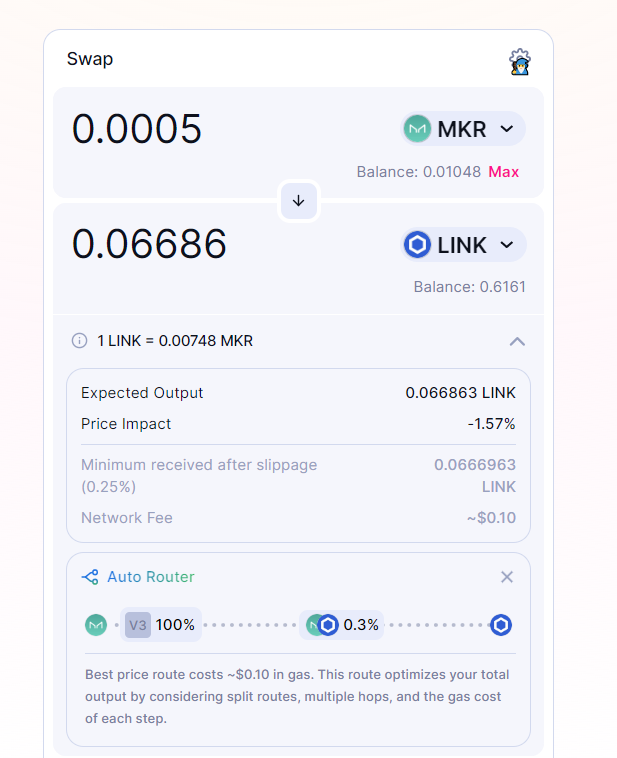{width="50%"}

Breaking down the results of `swap_across_ticks()`: 

```{r}
# won't need a price column in positions.
position_tbl_final$price = NULL

swp <- swap_across_ticks(ptbl = position_tbl_final, 
                  sqrtpx96 = '6786861222905019303556225263',
                  fee_tbl = NULL, trade_record = NULL, dx = NULL, 
                  dy = 0.0005)

```

- The position table (`ptbl`) *after* the swap shows that position 1 is no longer active.

```{r}
reactable(
  swp$ptbl
)
```

- This is because the `new_price`, 0.007575... is above position 1's max_price of 0.007433.

```{r}
reactable(
  data.frame(
    new_price_px96 = as.character(swp$new_price),
    new_price_yx = sqrtpx96_to_price(swp$new_price)
  )
)

```

The swap results in a change in the pool's competition. 0.0004985 MKR `dy_in` went into the pool while 0.0000015 MKR `dy_fee` are distributed as fees to the liquidity providers proportional to their *active* liquidity (which changes mid-swap!).

```{r}
reactable(
  data.frame(
    mkr_in = swp$dy_in,
    mkr_fees = swp$dy_fee
  )
)
```

The swap removes (note the negative) 0.06686299 LINK `dx_out` from the pool. Due to known
precision loss when calculating the liquidity of each position due to use of non fixed point math this is within 0.0001% of the contract's actual output in [this live transaction](https://optimistic.etherscan.io/tx/0xc50d67d5ca3b677b039c8888fd131fa4d2136bbae34341923d5ef87249cdca59). 

```{r}
reactable(
  data.frame(
    link_out = swp$dx_out,
    contract_link_out = -0.06686308627670671,
    ratio_contract_estimate = -0.06686308627670671/swp$dx_out
  )
)

```

The resulting `fee_tbl` shows all positions, whether their active *after* the swap 
and fees accumulating during the swap. 

```{r}
reactable(
  data.frame(
    swp$fee_tbl
  )
)
```

Adding up the fees confirms the positions spread the correct amount of fees.

```{r}
reactable(
  data.frame(
    mkr_fee = swp$dy_fee,
    position_fees_earned = sum(swp$fee_tbl$yfee)
  )
)
```

# Conclusion 

The inspiration of this (long) explanation of how Uniswap v2 and v3 function was 
to develop an R package that could accurately simulate all relevant actions and results for participating in Uniswap. With all relevant functions created and tested and accurate 
within tolerance (due to how the real contracts use fix point math) we can now retroactively 
go to any block height; check all available liquidity positions and begin the next phase: 
retroactive optimization.

Given a starting block height, available liquidity at that height, and a sneak peek of 
X swaps occurring in the next N blocks: what *marginal liquidity* position would maximize 
the fee revenue over those N blocks. Similarly, what range of liquidity would maximize the 
profit of the position: fee revenue minus divergent loss (the change in value of your assets when you sell one in exchange for the other).


