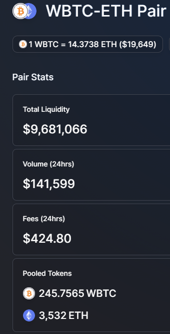

```{css, echo=FALSE}

@import url('https://fonts.googleapis.com/css?family=Inter');
@import url('https://fonts.googleapis.com/css?family=Roboto+Mono');

body {
  background-color: #10151A;
  background-position: center top;
  background-size: 300px 117px;
  padding-left: 10%;
  padding-right: 10%;
  padding-top: 118px;
  color: #C4CDD5;
  font-size: 18px;
  font-weight: 400;
  font-family: Inter;
  margin-top: 10px;
}

hr {
  width: 85%;
  color: #C4CDD5;
}

.tocify {
  background-color: #10151A;
  font-size: 14px;  
  color: #C4CDD5;
  border: 0;
}

.list-group-item.active, .list-group-item.active:focus, .list-group-item.active:hover {
    background-color: #DC4F9C;
    border-color: #DC4F9C;
}

.list-group-item {
  background-color: #10151A;
}

h1 {
  font-size: 1.4em;
  padding-top: 10px;
  color: #DC4F9C;
}

h2 {
  font-size: 1.1em;
  padding-top: 10px;
  color: #6FCCDD;
}

h3 {
  font-size: 1.1em;
  padding-top: 10px;
  color: white;
}

.plotly {
  margin: 30px;
}

.rt-page-button-current  {
  color: #FFF;
}
.rt-thead {
  background-color: #10151A;
  color: #FFFFFF;
  text-align: center;
  vertical-align: middle;
}

.rt-th-content {
  text-align: center;
  vertical-align: middle;
}

.ReactTable {
  background-color: #171e25;
  color: #C4CDD5;
  border: none;
  font-family: Roboto Mono;
  font-size: 0.8em;
}

.rt-th {
  border: 0px solid #000000 !important;
  padding-top: 15px;
  padding-bottom: 15px;
  font-weight: 400;
  font-family: Inter;
}
.rt-tr {
  padding-top: 5px;
  padding-bottom: 5px;
}
.rt-pagination {
  margin: 0;
  background: #171e25;
  opacity: 0.5;
  border-bottom: 1px solid #C4CDD5;
  border-top: 1px solid #C4CDD5;
}

.btn {
  color: #FFF;
  background: none;
  border: none;
  padding: 0;
}

#TOC {
 margin: 71px 0px 20px 0px;
}
```

# Intro

Uniswap v2 is an automatic market maker that pools deposits of 2 tokens, here we will assume Ether (ETH) and wrapped Bitcoin (wBTC), and allows anyone to autonomously trade between the assets using that pool by paying a fee, e.g., 0.3%.

To do this, it takes both extreme relative prices:

-   1 ETH = 0 BTC
-   1 ETH = Infinite BTC

And uses a constant product function `x * y = k` to calculate how much of token x to provide to traders looking to offload token y. Note this is separate from the 0.3% fee. All trades, but especially large trades, *impact the relative price* of the tokens when trading, this is called price impact.

# Simulated WBTC-ETH Uniswap v2 Pool

For example, assume the current price of 1 ETH is 0.1 WBTC and that a liquidity pool exists with 1,000 ETH and 100 WBTC. This means the constant product `k = 1000*100 = 100,000`

Any trade is allowable as long as the resulting balance of X ETH and Y WBTC remains 100,000. Notice how US Dollar prices are not relevant. It is only the constant product enforcing relative prices that matters.

```{r, warning=FALSE, message=FALSE, fig.show='hide'}
options(scipen = 20)
library(dplyr)
library(plotly)
library(reactable)

kfunc <- function(x, k = 100000){
  # returns y for an x that meets condition x*y = k
 y = k/x
 return(y)
}


# draws plot and returns values 
# This plots by default: suppressing this to only get data.
x <- curve(kfunc, 0, 1000, n = 1001, xlab = 'BTC', ylab = 'ETH')
```

```{r,  warning=FALSE, message=FALSE}
pool <- data.frame(
  btc = x$x,
  eth = x$y
)

# for simplicity focus in on 100 BTC range
relevant_pool <- pool[50:180, ]

plot_ly(relevant_pool, x = ~btc) %>% 
  add_trace(y = ~eth, mode = 'lines', type = 'scatter', name = 'Constant Product') %>% 
  add_trace(x = ~100, y = ~1000, type = 'scatter', mode = 'markers', name = 'Current Price') %>% 
  layout(title = "Close up of Constant Product Curve around 100 BTC",
         annotations = list(x = 105, y = 1100,
                            text = 'Current Price',
                            showarrow = FALSE))
  
```

The orange point denotes the current (relative) price 1 ETH = 0.1 BTC, or more specifically 100 BTC = 1,000 ETH. But to *trade* with the pool *causes* a change in the price.

Reviewing the table form of the 95 - 105 BTC range where k = 100,000 shows the price point of several potential trades.

```{r,  warning=FALSE, message=FALSE}
price_snippet <- pool[96:106, ]
price_snippet$btc_delta <- price_snippet$btc - 100
price_snippet$eth_delta <- price_snippet$eth - 1000
price_snippet <- price_snippet %>% round(4) # 4 decimals

reactable(price_snippet %>% round(3), defaultPageSize = 25)
```

If you have 1 BTC and want ETH you would change the pool balance from:

-   100 BTC and 1000 ETH

to

-   101 BTC and 990.099 ETH

Meaning that although the price *was* 0.1 BTC per ETH originally. You actually only get `r 1000 - 990.099` ETH for your 1 BTC (would be less after any fee, e.g., 0.3%). This is the *price impact* mentioned previously. Instead of 0.1 BTC per ETH, you pay 0.10099 BTC per ETH. a **0.99%** price impact.

In the other direction if you want 5 BTC you would need to provide 52.6316 ETH to change the pool's composition to 95 BTC (and 1,052.6316 ETH). Instead of 0.1 BTC per ETH, you only get 0.09499 BTC per ETH. A **5.01%** price impact.

The larger the trade (5 BTC instead of 1 BTC) the worse the price impact.

The solution to this is to widen the curve by deepening the liquidity available. If instead the pool was 10,000 BTC and 100,000 ETH, trades of 1 BTC or even 5 BTC would be much closer to 0.1 BTC per ETH (it would not be exact because price impact still occurs).

# Real World WBTC-ETH Uniswap v2 Pool

Looking at the [Uniswap v2 ETH/WBTC pool](https://v2.info.uniswap.org/pair/0xbb2b8038a1640196fbe3e38816f3e67cba72d940%3E) analytics page.

{width="300"}

245.7565 WBTC and 3,532 ETH are in this pool. This is a relative price of 0.06957 BTC per ETH. Bitcoin is doing better against ETH than in the fake example above.

The constant product `k = 245.7565 * 3532 = 868,012`. This makes the real pool significantly more *deep* than in the fake intro example. So price impacts should be much smaller!

The constant product curve for the real pool is here:

```{r, fig.show='hide'}

x_real <- curve(kfunc(x, k = 868012), 200, 300, n = 100000, xlab = 'BTC', ylab = 'ETH', add = FALSE)

```

```{r,  warning=FALSE, message=FALSE}
pool_real <- data.frame(
  btc = x_real$x,
  eth = x_real$y
)

plot_ly(pool_real, x = ~btc) %>% 
  add_trace(y = ~eth, mode = 'lines', type = 'scatter', name = 'Constant Product') %>% 
  add_trace(x = ~245.7565, y = ~3532, type = 'scatter', mode = 'markers', name = 'Current Price') %>% 
  layout(title = "Close up of Constant Product Curve around 245 BTC",
         annotations = list(x = 255, y = 3590,
                            text = 'Current Price',
                            showarrow = FALSE))
```

Unlike before, because this pool is deeper a move of 1 BTC is much more easily absorbed.

```{r,  warning=FALSE, message=FALSE}
one_increments <- pool_real[seq(from = 40757, 50757, by = 1000), ]

one_increments$btc_delta <- one_increments$btc - 245.7565
one_increments$eth_delta <- one_increments$eth - 3532
one_increments <- one_increments %>% round(2) # 3 decimals
reactable(one_increments)
```

Selling 1 BTC to force the pool from 245.7565 to 246.7565 would remove 14.3131 ETH form the pool. This `r 1/14.3131` BTC per ETH is very close to the original relative price of 0.06957 BTC per ETH, only a **0.42%** price impact.

In the other direction if you want 5 BTC you would need to provide 73.3537 ETH. This `r 5/73.3537` BTC per ETH a **2.02%** price impact.

## Real World Uniswap v2 Confirmation

The 245.7565 WBTC; 3,532 ETH V2 Pool was as of Block 15,562,988. [This transaction](https://etherscan.io/tx/0x1f23e1feb1def28e5b5c7c4800dc66ff8338e114657593d08d9c6891471806d5) shows a trade of 1.3159 ETH for 0.0913 BTC in that block.

The constant product math with `k = 868,012` including the 0.3% fee would expect the following result:

`( 3532 - (1.3159*0.997) ) * (245.7565 + x) = 868,012`

Where the expected 0.0913 matches the transaction.

x = `round(868012/(3532 - 1.3159*0.997) - 245.7565, 4)`

x = `r round(868012/(3532 - 1.3159*0.997) - 245.7565, 4)`

Rounding, in addition to the possibility of *other trades* happening in the same block before this transaction (blocks are comprised on transactions and transactions within a block go in order) affecting the pool could lead to small differences in the expected and actual results. But our calculation and the real world matched to 4 significant digits.
